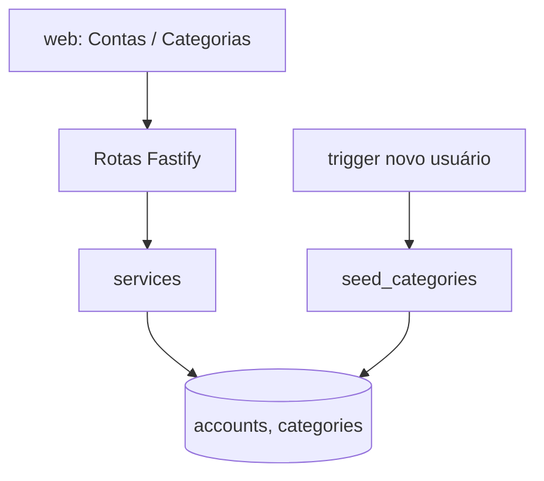

# Contas e Categorias Design

**Spec**: `.specs/features/accounts-categories/spec.md`
**Status**: Draft

---

## Architecture Overview

Dois módulos REST na API (`accounts`, `categories`) sobre o padrão de tabela de dados definido em `auth/design.md`. As categorias iniciais são semeadas por uma função SQL chamada pelo trigger de novo usuário. A proteção das categorias de sistema fica no RLS (policies de update/delete exigem `not is_system`) e é repetida na API para devolver 403 com mensagem.



---

## Code Reuse Analysis

### Existing Components to Leverage

| Component | Location | How to Use |
| --------- | -------- | ---------- |
| `withUser` | `api/src/plugins/db.ts` | Toda query roda dentro dele |
| `AppError` | `api/src/plugins/errors.ts` | 403, 404, 409, 422 |
| Padrão de tabela | `auth/design.md` | `user_id`, RLS, policies |

### Integration Points

| System | Integration Method |
| ------ | ------------------ |
| `transactions`, `credit_expenses` | FK composta `(category_id, user_id)` e `(account_id, user_id)` |
| `import` | Lê `accounts.holder_names` e `accounts.bank` |

---

## Components

### `api/src/modules/accounts`

- **Purpose**: CRUD sem exclusão, desativar e reativar contas.
- **Interfaces**:
  - `GET /accounts?active=` - lista (todas por padrão; `active=true` para seleção).
  - `POST /accounts` - `{ bank, nickname, holderNames[] }`.
  - `PATCH /accounts/:id` - edita banco, apelido, titulares.
  - `POST /accounts/:id/deactivate`, `POST /accounts/:id/activate`.
  - Sem `DELETE` (ACCT-02).
- **Dependencies**: `withUser`, `normalizeName` (aparar titulares, rejeitar duplicados na conta).

### `api/src/modules/categories`

- **Purpose**: CRUD de categorias comuns e exclusão com reatribuição.
- **Interfaces**:
  - `GET /categories` - com `key`, `name`, `isSystem`.
  - `POST /categories` - `{ name }`.
  - `PATCH /categories/:id` - renomeia; 403 `category_protected` se `is_system`.
  - `DELETE /categories/:id?reassignTo=<uuid>` - uma transação: reatribui `transactions` e `credit_expenses`, depois exclui; 422 se em uso sem `reassignTo` ou se `reassignTo` é a própria categoria; 403 se `is_system`.
- **Dependencies**: `withUser`.

### `web/src/features/accounts` e `web/src/features/categories`

- **Purpose**: Telas de gestão; seletores reutilizáveis (`AccountSelect` só com contas ativas, `CategorySelect`).
- **Interfaces**: `useAccounts({active})`, `useCategories()`, `<CategorySelect value onChange />`.
- **Reuses**: cliente `api` e estado de consulta (TanStack Query).

---

## Data Models

```sql
-- supabase/migrations/0002_accounts_categories.sql
create table public.accounts (
  id uuid primary key default gen_random_uuid(),
  user_id uuid not null default auth.uid() references auth.users(id) on delete cascade,
  bank text not null check (bank in ('Nubank','SofisaDireto','Neon','XP','Other')),
  nickname text not null check (length(btrim(nickname)) > 0),
  holder_names text[] not null check (cardinality(holder_names) >= 1),
  active boolean not null default true,
  created_at timestamptz not null default now(),
  unique (id, user_id)
);
create unique index accounts_nickname_uq on public.accounts (user_id, lower(btrim(nickname)));

create table public.categories (
  id uuid primary key default gen_random_uuid(),
  user_id uuid not null default auth.uid() references auth.users(id) on delete cascade,
  key text,                          -- identificador estável das categorias semeadas
  name text not null check (length(btrim(name)) > 0),   -- texto exibido (pt-BR)
  is_system boolean not null default false,
  created_at timestamptz not null default now(),
  unique (id, user_id)
);
create unique index categories_name_uq on public.categories (user_id, lower(btrim(name)));
create unique index categories_key_uq on public.categories (user_id, key) where key is not null;

alter table public.accounts enable row level security;
alter table public.categories enable row level security;
create policy accounts_all on public.accounts for all
  using (user_id = auth.uid()) with check (user_id = auth.uid());
create policy categories_select on public.categories for select using (user_id = auth.uid());
create policy categories_insert on public.categories for insert
  with check (user_id = auth.uid() and not is_system);
create policy categories_update on public.categories for update
  using (user_id = auth.uid() and not is_system) with check (user_id = auth.uid() and not is_system);
create policy categories_delete on public.categories for delete
  using (user_id = auth.uid() and not is_system);
-- accounts: sem policy de delete específica => `for all` inclui delete; a API não expõe a rota
-- e a migration revoga delete: revoke delete on public.accounts from authenticated;

create function public.seed_categories(p_user uuid) returns void
language sql security definer set search_path = public as $$
  insert into public.categories(user_id, key, name, is_system) values
    (p_user,'Entertainment','Entretenimento',false),
    (p_user,'Food','Alimentação',false),
    (p_user,'Salaries','Salários',false),
    (p_user,'Healthcare','Saúde',false),
    (p_user,'Utilities','Utilidades',false),
    (p_user,'Unknown','Desconhecida',false),
    (p_user,'Transport','Transporte',false),
    (p_user,'Help','Ajuda (a terceiros)',false),
    (p_user,'PJ','PJ',false),
    (p_user,'Bills','Contas',false),
    (p_user,'Emergency','Emergência',false),
    (p_user,'Uncategorized','Sem categoria',true),
    (p_user,'Wishes','Desejos',false),
    (p_user,'Reversal','Estorno (de compras)',true),
    (p_user,'Shopping','Compras',false),
    (p_user,'Pets','Pets',false),
    (p_user,'Investments','Investimentos',true);
$$;
```

**Relationships**: `transactions.category_id` e `credit_expenses.category_id` referenciam `categories` com `on delete restrict`; contas nunca são excluídas, então `account_id` usa `on delete restrict`.

---

## Error Handling Strategy

| Error Scenario | Handling | User Impact |
| -------------- | -------- | ----------- |
| Apelido ou nome de categoria duplicado | Violação do índice único → 409 `duplicate_name` | Mensagem no campo |
| Conta sem titular | 422 `holder_required` | "Informe ao menos um titular" |
| Editar/excluir categoria de sistema | 403 `category_protected` | "Categoria protegida" |
| Excluir categoria em uso sem destino | 422 `reassign_required` | Diálogo pede o destino |
| Falha na reatribuição | Transação revertida | Categoria e transações intactas |

---

## Risks & Concerns

| Concern | Location (file:line) | Impact | Mitigation |
| ------- | -------------------- | ------ | ---------- |
| Categorias semeadas podem ser editadas via SQL por quem tiver acesso ao banco, ignorando RLS | `0002_accounts_categories.sql` | Regra de sistema contornada fora da API | Aceito: apenas papéis `authenticated` passam por RLS; sem chave de serviço na API (AD-002) |
| Exclusão de conta não é possível pela API, mas `for all` do RLS permitiria `delete` por SQL direto | `0002_accounts_categories.sql` | Violaria ACCT-02 | `revoke delete on public.accounts from authenticated` na migration e teste que falha ao tentar |
| Semeadura duplicada se o trigger rodar duas vezes | `seed_categories` | Violação do índice único | O índice por `key` impede duplicata; teste cobre |

---

## Tech Decisions (only non-obvious ones)

| Decision | Choice | Rationale |
| -------- | ------ | --------- |
| Categoria protegida | Coluna `is_system` + RLS | Defesa em profundidade além da API |
| Nomes pt-BR | Guardados em `name` na semeadura; `key` estável | Permite renomear comuns sem perder a identidade de regra (`Reversal`, `Investments`) |
| Regras especiais por `key` | Cálculos usam `categories.key`, nunca o nome | Renomear não quebra regras (e as de sistema nem renomeiam) |
| Banco `SofisaDireto` | Valor interno sem espaço | Enumeração estável; rótulo pt-BR no frontend |
