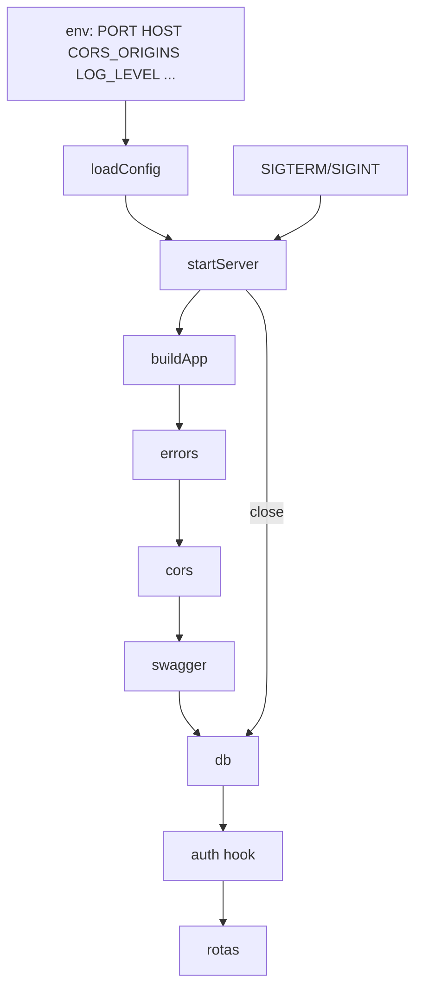

# Servidor da API e CORS Design

**Spec**: `.specs/features/api-server/spec.md`
**Status**: Draft

---

## Architecture Overview

`buildApp(config)` continua sendo a fábrica testável. Um novo `src/server.ts` expõe `startServer(env)` (carrega a configuração, constrói o app, escuta e devolve `{ app, address, close }`) e um `main` que o chama e instala os manipuladores de SIGTERM e SIGINT. O CORS é um plugin (`@fastify/cors`) registrado **antes** do plugin de autenticação, para o preflight ser respondido no hook `onRequest` antes de qualquer verificação de token.

---

## Code Reuse Analysis

| Component | Location | How to Use |
| --------- | -------- | ---------- |
| `loadConfig`, `AppConfig` | `api/src/config.ts` | Estender com `port`, `host`, `corsOrigins`, `logLevel` |
| `buildApp` | `api/src/app.ts` | Receber o logger e registrar o plugin de CORS antes da autenticação |
| Plugin de erros | `api/src/plugins/errors.ts` | Corpo do 401 que o CORS precisa expor |
| `fastify-plugin` | dependência existente | Plugin sem encapsulamento |

---

## Components

### `api/src/config.ts` (estendido)

- **Interfaces**: `AppConfig` ganha `port: number`, `host: string`, `corsOrigins: string[]`, `logLevel: string`. `parseCorsOrigins(raw)` normaliza (trim, remove barra final, descarta vazios, rejeita `*`). `PORT` inválida lança erro citando `PORT`.

### `api/src/plugins/cors.ts`

- **Purpose**: registrar `@fastify/cors` com lista exata de origens, métodos `GET, POST, PATCH, DELETE, OPTIONS`, cabeçalhos `authorization, content-type, x-timezone`, `maxAge: 600`, sem `credentials`.
- **Interfaces**: `corsPlugin` com opção `{ origins: string[] }`. Origem fora da lista (ou lista vazia) não recebe nenhum cabeçalho CORS.

### `api/src/server.ts`

- **Interfaces**: `startServer(env = process.env): Promise<{ app; address; close }>`; `main()` chamado quando o arquivo é o ponto de entrada; manipuladores de SIGTERM e SIGINT chamam `close()` e saem com 0; erro de configuração imprime mensagem e sai com 1.
- **Logger**: pino do Fastify com nível de `LOG_LEVEL` e redação de `req.headers.authorization`.

### Scripts e arquivos de apoio

`api/package.json`: `dev` (`tsx watch --env-file-if-exists=.env src/server.ts`), `build` (`tsc -p tsconfig.build.json`), `start` (`node --env-file-if-exists=.env dist/server.js`). `api/tsconfig.build.json` emite para `dist/`. `api/.env.example` documenta as variáveis do ambiente local. README ganha a seção de execução.

---

## Data Models

Nenhum.

---

## Error Handling Strategy

| Error Scenario | Handling | User Impact |
| -------------- | -------- | ----------- |
| `SUPABASE_URL` ou `DATABASE_URL` ausente | `main` imprime a variável ausente e sai com 1 | Falha clara na subida |
| `PORT` inválida | Erro de configuração citando `PORT` | Falha clara na subida |
| `CORS_ORIGINS` com `*` | Erro de configuração citando `CORS_ORIGINS` | Falha clara na subida |
| Porta em uso | Erro do `listen` propaga e `main` sai com 1 | Mensagem do Node |
| Origem não permitida | Resposta sem cabeçalhos CORS | O navegador bloqueia |

---

## Risks & Concerns

| Concern | Location (file:line) | Impact | Mitigation |
| ------- | -------------------- | ------ | ---------- |
| Ordem de registro: o hook de autenticação não pode rodar antes do preflight | `api/src/app.ts` | Preflight responderia 401 e o navegador recusaria | Registrar o CORS antes de auth e testar o preflight sem token |
| Nenhuma origem padrão pode parecer erro de configuração | `api/src/config.ts` | Front bloqueado sem mensagem | `.env.example` traz as origens de desenvolvimento e o README explica |
| Log de requisições pode vazar o token | `api/src/server.ts` | Vazamento de credencial | Redação do cabeçalho e teste que procura o token nos logs |

---

## Tech Decisions (only non-obvious ones)

| Decision | Choice | Rationale |
| -------- | ------ | --------- |
| Plugin de CORS | `@fastify/cors` | Padrão do Fastify; trata preflight no `onRequest` |
| Carregamento de `.env` | `--env-file-if-exists` do Node | Sem dependência nova |
| Produção | Build com `tsc` e `node dist/server.js` | Evita executar TypeScript em produção |
