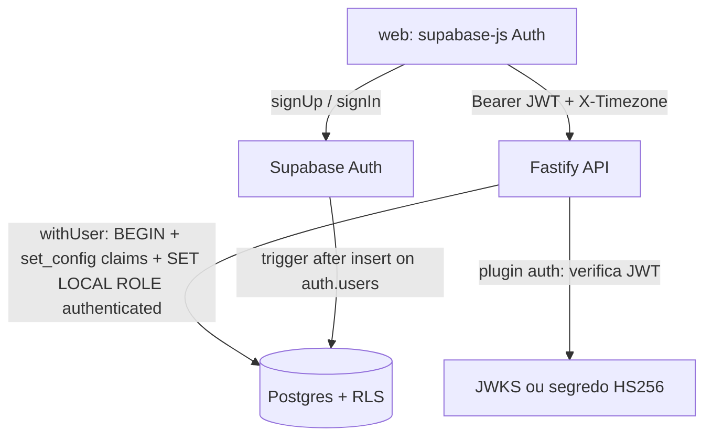

# Autenticação Design

**Spec**: `.specs/features/auth/spec.md`
**Status**: Draft

Contém também a **fundação compartilhada** de `api/` e do acesso a dados (AD-002), da qual todas as outras features dependem.

---

## Architecture Overview

O `web/` autentica direto no Supabase Auth (`supabase-js`: `signUp`, `signInWithPassword`) e envia o `access_token` como Bearer ao Fastify. A API valida o JWT, abre uma transação por requisição sob o papel `authenticated` com os claims do usuário e executa as queries; o RLS é a barreira final.



---

## Code Reuse Analysis

Projeto novo: não há código existente. Padrões definidos aqui são reutilizados pelas demais features.

### Integration Points

| System | Integration Method |
| ------ | ------------------ |
| Supabase Auth | `supabase-js` no `web/` (cadastro/login); a API só valida o JWT |
| Postgres | `postgres.js` com transação por requisição (AD-002) |
| Migrations | `supabase/migrations/*.sql` na raiz, aplicadas com Supabase CLI |

---

## Components

### `api/src/plugins/auth.ts`

- **Purpose**: Exigir e validar o Bearer JWT em toda rota exceto as marcadas como públicas (`/health`, `/docs`).
- **Interfaces**:
  - `verifyToken(token: string): Promise<JwtClaims>` - valida assinatura, expiração e extrai `sub`.
  - hook `onRequest` que preenche `request.user = { id, claims }` ou responde 401.
- **Dependencies**: `jose` (`createRemoteJWKSet` para chaves assimétricas; fallback HS256 com `SUPABASE_JWT_SECRET`), config `SUPABASE_URL`.
- **Reuses**: nada.

### `api/src/plugins/db.ts`

- **Purpose**: Entregar `request.withUser(fn)` que roda `fn(sql)` dentro de uma transação com RLS ativo.
- **Interfaces**:
  - `withUser<T>(claims: JwtClaims, fn: (tx: Sql) => Promise<T>): Promise<T>` - `BEGIN; select set_config('request.jwt.claims', $1, true); set local role authenticated; fn; COMMIT`.
- **Dependencies**: `postgres.js`, `DATABASE_URL` com papel autorizado a `SET ROLE authenticated`.
- **Reuses**: nada.

### `api/src/plugins/timezone.ts`

- **Purpose**: Ler `X-Timezone`, validar como zona IANA e expor `request.tz`.
- **Interfaces**: `request.tz: string` (padrão `America/Sao_Paulo`; zona inválida → 400).
- **Dependencies**: Luxon (`IANAZone.isValidZone`).

### `api/src/plugins/errors.ts`

- **Purpose**: Formato único de erro `{ error: { code, message, field? } }` e mapeamento de erros de validação, 401, 403, 404, 409, 422.
- **Interfaces**: `AppError(code, status, message, field?)`.

### `web/src/features/auth/`

- **Purpose**: Telas de cadastro e login, sessão e rota protegida.
- **Interfaces**:
  - `useSession(): { session, signIn, signUp, signOut }`.
  - `<RequireAuth>` redireciona para `/login` quando não há sessão (AUTH-05).
  - `signUp` detecta e-mail já cadastrado e exibe "E-mail já cadastrado".
- **Dependencies**: `supabase-js`, React Router.
- **Reuses**: cliente `api` com interceptador que anexa Bearer e `X-Timezone` (`Intl.DateTimeFormat().resolvedOptions().timeZone`).

---

## Data Models

```sql
-- supabase/migrations/0001_profiles_and_seed.sql
create table public.profiles (
  id uuid primary key references auth.users(id) on delete cascade,
  name text not null,
  nickname text not null,
  created_at timestamptz not null default now()
);
alter table public.profiles enable row level security;
create policy profiles_select on public.profiles for select using (id = auth.uid());
create policy profiles_update on public.profiles for update using (id = auth.uid());

-- função security definer chamada pelo trigger em auth.users
create function public.handle_new_user() returns trigger
language plpgsql security definer set search_path = public as $$
begin
  insert into public.profiles(id, name, nickname)
  values (new.id, coalesce(new.raw_user_meta_data->>'name',''), coalesce(new.raw_user_meta_data->>'nickname',''));
  -- a semeadura de categorias é adicionada por accounts-categories (migration 0002 redefine esta função)
  return new;
end $$;
create trigger on_auth_user_created after insert on auth.users
  for each row execute function public.handle_new_user();
```

**Padrão de tabela de dados (obrigatório em todas as features):** `user_id uuid not null default auth.uid() references auth.users(id) on delete cascade`, `alter table ... enable row level security` e policies `using/with check (user_id = auth.uid())`. Teste de isolamento percorre todas as tabelas listadas em um catálogo.

---

## Error Handling Strategy

| Error Scenario | Handling | User Impact |
| -------------- | -------- | ----------- |
| Sem Bearer / JWT inválido ou expirado | 401 `unauthorized` | Frontend limpa a sessão e vai ao login |
| Registro de outro usuário por id | RLS devolve 0 linhas → 404 | "Não encontrado" |
| Campo obrigatório ausente ou formato inválido | 400/422 com `field` | Mensagem no campo |
| Supabase Auth indisponível no login | Erro de rede no `supabase-js` mapeado | "Serviço indisponível, tente novamente" |
| `signUp` com falha de envio de e-mail | Erro do Auth exibido de forma genérica | "Não foi possível enviar a confirmação" |

---

## Risks & Concerns

| Concern | Location (file:line) | Impact | Mitigation |
| ------- | -------------------- | ------ | ---------- |
| Tipo de assinatura do JWT. **Verificado no stack local (CLI 2.119): tokens de usuário são ES256, publicados em `/auth/v1/.well-known/jwks.json`; o `JWT_SECRET` HS256 assina só as chaves anon e service_role.** Projeto de produção futuro deve ser confirmado | `api/src/plugins/auth.ts` | Rejeitar tokens válidos ou aceitar inválidos | JWKS é o modo principal; HS256 fica como fallback por configuração; testes de integração usam token real obtido por login no GoTrue |
| Comportamento do `signUp` com e-mail existente (resposta ofuscada contra enumeração) não verificado | `web/src/features/auth` (a criar) | Spec AUTH-01.5 exige "E-mail já cadastrado" | Primeira tarefa verifica o retorno real; se não for detectável, registrar suposição revisada e levar ao usuário |
| `SET ROLE authenticated` exige papel de conexão com esse privilégio | `api/src/plugins/db.ts` (a criar) | Falha de todas as queries | Teste de integração de smoke que lê `auth.uid()` dentro de `withUser` |
| Trigger em `auth.users` é `security definer` | migration 0001 | Escalada de privilégio se mal escrito | `set search_path = public`, sem SQL dinâmico, revisão na verificação |
| Conexão por pooler em modo transação | `api/src/plugins/db.ts` | `set_config` sem `local` vazaria entre requisições | Sempre `set_config(..., true)` dentro de `BEGIN`; teste de vazamento entre dois usuários |

---

## Tech Decisions (only non-obvious ones)

| Decision | Choice | Rationale |
| -------- | ------ | --------- |
| Cadastro e login | Direto do `web/` ao Supabase Auth | PRD: Supabase emite o JWT; menos código na API |
| Perfil | Tabela `profiles` preenchida por trigger | Guarda nome e apelido; semeia categorias na criação (AUTH-04) |
| Validação de schemas da API | TypeBox + `@fastify/type-provider-typebox` | Gera JSON Schema para OpenAPI (AD-001) |
| Biblioteca JWT | `jose` | Suporta JWKS remoto e HS256 |
| Testes | Vitest com Postgres do Supabase local (`supabase start`) | RLS e transações exigem Postgres real |
