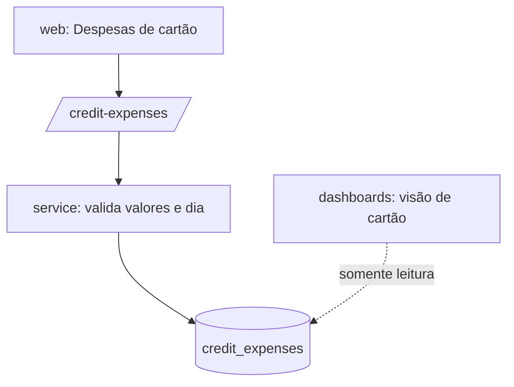

# Despesas de Cartão Design

**Spec**: `.specs/features/credit-expenses/spec.md`
**Status**: Draft

---

## Architecture Overview

Módulo CRUD simples, sem relação com `transactions`. O valor restante é calculado na leitura (`total_amount - paid_amount`). Nenhuma query de `dashboards` totaliza esta tabela fora da visão de cartão.



---

## Code Reuse Analysis

### Existing Components to Leverage

| Component | Location | How to Use |
| --------- | -------- | ---------- |
| `withUser`, `AppError`, `request.tz` | `api/src/plugins/*` | Infraestrutura comum |
| `parseAmount` | `api/src/modules/transactions/validation.ts` | Validar `totalAmount` e `paidAmount` |
| `AccountSelect`, `CategorySelect` | `web/src/features/*` | Formulário |

### Integration Points

| System | Integration Method |
| ------ | ------------------ |
| `categories` | `category_id` com FK composta; exclusão de categoria reatribui estas linhas |
| `dashboards` | Visão de cartão lê status `Active`, `Once`, `ToCancel` |

---

## Components

### `api/src/modules/creditExpenses`

- **Purpose**: CRUD e filtro por status.
- **Interfaces**:
  - `GET /credit-expenses?status=` - cada item inclui `remainingAmount`.
  - `POST /credit-expenses`, `PATCH /credit-expenses/:id`, `DELETE /credit-expenses/:id`.
  - Valida: `totalAmount > 0`; `0 ≤ paidAmount ≤ totalAmount` (inclusive ao reduzir o total); `recurrencyDay` inteiro 1–31; `status` ∈ lista; conta ativa na criação.
- **Dependencies**: `withUser`, `parseAmount`.

### `web/src/features/creditExpenses`

- **Purpose**: Lista com filtro por status, formulário e troca manual de status.
- **Interfaces**: `<CreditExpensesTable />` (mostra restante), `<CreditExpenseForm />`, `<StatusSelect />` (todos os 5 status, sem restrição de transição).

---

## Data Models

```sql
-- supabase/migrations/0005_credit_expenses.sql
create table public.credit_expenses (
  id uuid primary key default gen_random_uuid(),
  user_id uuid not null default auth.uid() references auth.users(id) on delete cascade,
  account_id uuid not null,
  category_id uuid not null,
  name text not null check (length(btrim(name)) > 0),
  total_amount numeric(14,2) not null check (total_amount > 0),
  paid_amount numeric(14,2) not null default 0,
  occurred_at timestamptz not null,
  recurrency_day smallint not null check (recurrency_day between 1 and 31),
  status text not null check (status in ('Once','Active','Inactive','Canceled','ToCancel')),
  notes text,
  created_at timestamptz not null default now(),
  check (paid_amount >= 0 and paid_amount <= total_amount),
  foreign key (account_id, user_id) references public.accounts(id, user_id) on delete restrict,
  foreign key (category_id, user_id) references public.categories(id, user_id) on delete restrict
);
alter table public.credit_expenses enable row level security;
create policy credit_expenses_all on public.credit_expenses for all
  using (user_id = auth.uid()) with check (user_id = auth.uid());
```

---

## Error Handling Strategy

| Error Scenario | Handling | User Impact |
| -------------- | -------- | ----------- |
| Valor total ≤ 0 | 422 `invalid_amount` | Mensagem no campo |
| `paid_amount` fora de 0..total | 422 `invalid_paid_amount` | Mensagem no campo |
| `recurrency_day` inválido | 422 `invalid_day` | Mensagem no campo |
| Status fora da lista | 422 `invalid_status` | Seletor não oferece outros |
| Redução do total abaixo do pago | 422 `invalid_paid_amount` | Edição rejeitada |

---

## Risks & Concerns

| Concern | Location (file:line) | Impact | Mitigation |
| ------- | -------------------- | ------ | ---------- |
| Constraint `check` do banco e validação da API podem divergir | `0005_credit_expenses.sql`, `creditExpenses/service.ts` | Mensagem de erro genérica do banco | Validação na API primeiro; `check` como rede de segurança; teste de cada regra |
| Dupla contagem com `transactions` CreditCard | `dashboards` | Totais inflados | Fora dos totais por regra (CARD-05); teste de totais inalterados |

---

## Tech Decisions (only non-obvious ones)

| Decision | Choice | Rationale |
| -------- | ------ | --------- |
| Valor restante | Calculado na leitura, sem coluna | Evita divergência com `paid_amount` |
| Transição de status | Sem máquina de estados | PRD: manual no piloto |
