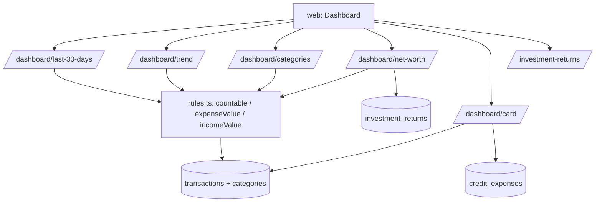

# Dashboards e Patrimônio Design

**Spec**: `.specs/features/dashboards/spec.md`
**Status**: Draft

---

## Architecture Overview

Todas as agregações rodam no Postgres e reutilizam os fragmentos SQL de um único módulo (`rules.ts`, AD-003). A API calcula as fronteiras de tempo (30 dias, meses) em TypeScript com Luxon a partir de `request.tz` e as passa como parâmetros; o SQL só agrega. Os lançamentos de rendimento têm CRUD próprio e entram só no patrimônio.



---

## Code Reuse Analysis

### Existing Components to Leverage

| Component | Location | How to Use |
| --------- | -------- | ---------- |
| `withUser`, `request.tz` | `api/src/plugins/*` | Acesso e fuso |
| `transactions`, `categories`, `credit_expenses` | migrations 0002/0003/0005 | Fonte dos números |
| `formatBRL` | `web/src/lib/format` | Exibição |

### Integration Points

| System | Integration Method |
| ------ | ------------------ |
| `categories.key` | Regras usam `Reversal` e `Investments` por `key`, nunca por nome |
| `transactions.payment_method` | `CreditCard` fica fora dos totais |

---

## Components

### `api/src/modules/dashboards/rules.ts` (fonte única, AD-003)

- **Purpose**: Fragmentos SQL das regras de cálculo.
- **Interfaces** (alias `t` = transactions, `c` = categories):
  - `COUNTABLE`: `NOT t.neutral AND t.payment_method <> 'CreditCard' AND c.key <> 'Investments' AND t.occurred_at <= now()` (com `join categories c on c.id = t.category_id`).
  - `EXPENSE_VALUE`: `CASE WHEN t.type='Expense' THEN t.amount WHEN t.type='Income' AND c.key='Reversal' THEN -t.amount ELSE 0 END`.
  - `INCOME_VALUE`: `CASE WHEN t.type='Income' AND c.key <> 'Reversal' THEN t.amount ELSE 0 END`.
  - `NET_VALUE = INCOME_VALUE - EXPENSE_VALUE` (patrimônio de transações).
- **Dependencies**: nenhuma; é um módulo de constantes testado contra Postgres.

### `api/src/modules/dashboards/queries.ts` e `routes.ts`

- **Purpose**: Uma função por painel, todas montadas com `rules.ts`.
- **Interfaces**:
  - `GET /dashboard/last-30-days` - `{ total, previousTotal, changePct | null }`; janela `[início do dia local D-29, início do dia local D+1)`; anterior = 30 dias imediatamente antes; `changePct` nulo quando `previousTotal = 0` (UI mostra "sem base de comparação").
  - `GET /dashboard/trend` - 12 meses-calendário (mês corrente + 11 anteriores) via `generate_series`, `left join` agregado por `date_trunc('month', occurred_at at time zone $tz)`; meses vazios = 0; `balance = income − expense`.
  - `GET /dashboard/categories?from&to` - padrão mês corrente local; soma de `EXPENSE_VALUE` por categoria (Estorno aparece negativo); soma das linhas = total de despesas do período; omite grupos com soma 0.
  - `GET /dashboard/net-worth` - `{ current, series[] }`; série mensal acumulada de `NET_VALUE` + retornos de investimento a partir do primeiro mês com transação ou rendimento até o mês corrente; `current` = último ponto.
  - `GET /dashboard/card?from&to` - `{ transactions: [{ category, total }], creditExpenses: [{ category, remaining }] }`; transações `payment_method = 'CreditCard'` sem `COUNTABLE`, mas com `occurred_at <= now()`; CreditExpenses de status `Active`, `Once`, `ToCancel` com `sum(total_amount - paid_amount)`.
- **Dependencies**: `rules.ts`, `withUser`, Luxon.

### `api/src/modules/investmentReturns`

- **Purpose**: CRUD de lançamentos de rendimento.
- **Interfaces**:
  - `GET /investment-returns` - ordenado por data decrescente; devolve também `lastDate`.
  - `POST`, `PATCH /:id`, `DELETE /:id` - valor ≠ 0 com ≤ 2 casas, conta do usuário, data `YYYY-MM-DD`.
- **Dependencies**: `withUser`, `parseAmount` (variante que aceita sinal e rejeita zero).

### `web/src/features/dashboard`

- **Purpose**: Painéis e gráficos.
- **Interfaces**:
  - `<Last30DaysCard />`, `<TrendChart />` (barras receitas/despesas + linha de balanço), `<CategoryBreakdown />` (seletor de período), `<NetWorthChart />`, `<CardView />`.
  - `<InvestmentReturnsList />` e formulário; exibe a data do último lançamento e destaca quando passa de 30 dias (DASH-06.6).
  - Estados vazios com `R$ 0,00`.
- **Reuses**: `formatBRL`, cliente `api`, biblioteca de gráficos Recharts.

---

## Data Models

```sql
-- supabase/migrations/0006_investment_returns.sql
create table public.investment_returns (
  id uuid primary key default gen_random_uuid(),
  user_id uuid not null default auth.uid() references auth.users(id) on delete cascade,
  account_id uuid not null,
  occurred_on date not null,
  amount numeric(14,2) not null check (amount <> 0),
  notes text,
  created_at timestamptz not null default now(),
  foreign key (account_id, user_id) references public.accounts(id, user_id) on delete restrict
);
create index investment_returns_user_date_idx on public.investment_returns (user_id, occurred_on desc);
alter table public.investment_returns enable row level security;
create policy investment_returns_all on public.investment_returns for all
  using (user_id = auth.uid()) with check (user_id = auth.uid());
```

```typescript
interface Last30Days { total: string; previousTotal: string; changePct: number | null }
interface TrendPoint { month: string /* 'YYYY-MM' */; income: string; expense: string; balance: string }
interface CategoryTotal { categoryId: string; name: string; total: string /* pode ser negativo (Estorno) */ }
interface NetWorth { current: string; series: { month: string; value: string }[] }
```

**Relationships**: `investment_returns.account_id` → `accounts`. Sem coluna de dashboard materializada: tudo é derivado.

---

## Error Handling Strategy

| Error Scenario | Handling | User Impact |
| -------------- | -------- | ----------- |
| `from > to` ou data inválida | 422 `invalid_period` | Seletor de período mostra erro |
| Rendimento com valor 0 ou > 2 casas | 422 `invalid_amount` | Mensagem no campo |
| Sem dados | Respostas com zeros / listas vazias | Estado vazio com R$ 0,00 |
| Fuso inválido | 400 pelo plugin `timezone` | Frontend usa padrão e recarrega |

---

## Risks & Concerns

| Concern | Location (file:line) | Impact | Mitigation |
| ------- | -------------------- | ------ | ---------- |
| Regras duplicadas por cópia de SQL em outra consulta | `dashboards/queries.ts` (a criar) | Painéis divergentes | Só `rules.ts` define as expressões; teste de invariante: soma de categorias = total de despesas; teste que greppa SQL por `'Reversal'` fora de `rules.ts` |
| Patrimônio não considera contas desativadas de forma especial | `dashboards/queries.ts` | Nenhum (spec inclui transações de contas inativas) | Teste explícito com conta inativa |
| Série do patrimônio acumulada em SQL com janela sobre meses sem dado | `queries.ts` | Buracos na série | `generate_series` de meses + `sum() over (order by month)` |
| Fuso do usuário em janelas e meses | `queries.ts`, `request.tz` | Dia ou mês errado nas bordas | Fronteiras calculadas em Luxon e testadas em `America/Sao_Paulo` e `UTC` nas bordas |
| Desempenho sem índice por categoria + data | migration 0003 | Lentidão em muitos milhares de linhas | Índices existentes `(user_id, occurred_at)` e `(user_id, category_id)`; medir no MVP |

---

## Tech Decisions (only non-obvious ones)

| Decision | Choice | Rationale |
| -------- | ------ | --------- |
| Fronteiras de tempo | Calculadas em TypeScript, passadas ao SQL | Fuso IANA e horário de verão resolvidos em um só lugar |
| Dados de datas futuras | Excluídos com `occurred_at <= now()` | Spec: painéis refletem o realizado |
| Estorno | Entra como `-amount` em `EXPENSE_VALUE` quando `Income` | Mantém soma por categoria igual ao total |
| Biblioteca de gráficos | Recharts | Integra com React; sem preferência do usuário (revisável) |
