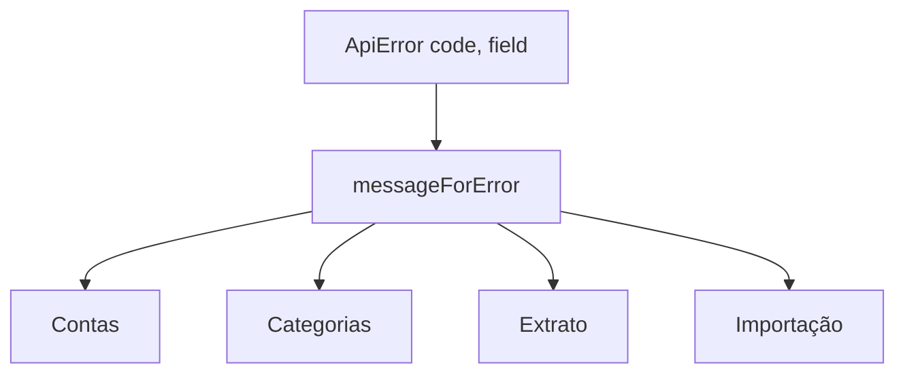

# Correções do Front Design

**Spec**: `.specs/features/front-fixes/spec.md`
**Status**: Draft

---

## Architecture Overview

Só `web/`. Um módulo de mensagens (`lib/api/errorMessages.ts`) concentra o mapa código → texto; as telas de contas, categorias e extrato o chamam em vez de ler `error.message`. O módulo de importação passa a reutilizar o genérico para os códigos comuns e mantém só os textos específicos.

---

## Code Reuse Analysis

| Component | Location | How to Use |
| --------- | -------- | ---------- |
| `ApiError` | `web/src/lib/api/client.ts` | Fonte de `code`, `field` e `status` |
| `importErrorMessage` | `web/src/features/import/errorMessages.ts` | Passa a delegar os códigos comuns ao mapa genérico |
| Testes do extrato | `web/src/features/transactions/transactions.test.tsx` | Padrão de render com `QueryClientProvider` e `apiRequest` mockado |
| `emailExists.ts` | `web/src/features/auth/emailExists.ts` | Ganha o critério por `confirmation_sent_at` |

---

## Components

### `web/src/lib/api/errorMessages.ts`

- **Interfaces**: `messageForError(error: unknown, context?: 'account' | 'category' | 'transaction' | 'import'): string`; `fieldForError(error: unknown): string | undefined`; constante `GENERIC_ERROR`.
- **Regra**: nunca devolve `error.message`; código desconhecido, falha de rede e tipos não `ApiError` devolvem `GENERIC_ERROR`.

### Telas (alterações pontuais)

- `AccountForm.tsx`, `AccountsPage.tsx` (erro ao ativar ou desativar), `CategoriesPage.tsx`, `TransactionForm.tsx`, `TransactionsPage.tsx`: substituem leituras de `error.message` pelo mapa.
- `TransactionForm.tsx`: na edição envia `notes`/`receipt` como `null` quando esvaziados.
- `TransactionsPage.tsx`: validação do período e cor das receitas.
- `emailExists.ts`: três critérios de e-mail já cadastrado.

---

## Data Models

Nenhum.

---

## Error Handling Strategy

| Error Scenario | Handling | User Impact |
| -------------- | -------- | ----------- |
| Código conhecido | Mensagem do mapa | Texto em português |
| Código desconhecido ou rede | `GENERIC_ERROR` | "Não foi possível concluir a operação. Tente novamente." |
| `field` informado | Mensagem no campo | Erro ao lado do campo |

---

## Risks & Concerns

| Concern | Location (file:line) | Impact | Mitigation |
| ------- | -------------------- | ------ | ---------- |
| Texto técnico ainda exibido em algum caminho esquecido | telas de contas, categorias, extrato | Inglês na tela | Teste que varre os códigos e um grep por `error.message` e `reason.message` em `web/src/features` |
| Testes dependem de `VITE_MOCK_AREAS` do ambiente | `web/vitest.config.ts` | Falhas locais | Já fixado em `*` no vitest |

---

## Tech Decisions (only non-obvious ones)

| Decision | Choice | Rationale |
| -------- | ------ | --------- |
| Um mapa com contexto | `messageForError(error, context)` | `duplicate_name` muda de texto entre conta e categoria |
