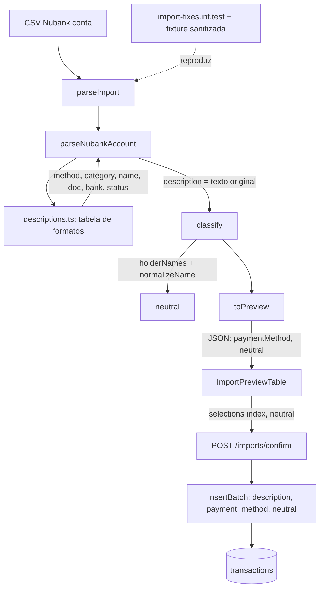

# Import: correções de método, formato e neutras Design

**Spec**: `.specs/features/import-fixes/spec.md`
**Status**: Draft

---

## Architecture Overview

Quatro mudanças pequenas no caminho que já existe (`parseImport` -> `classify` -> `toPreview` / `insertBatch` -> web), mais um teste de reprodução que as guia:

1. **Reprodução (B0)**: fixture sanitizada e teste de integração `import-fixes.int.test.ts`, commitados primeiro e vermelhos.
2. **`Other` (B1)**: o banco já aceita (migration 0007). A API passa a aceitar em `PAYMENT_METHODS` (transações e preview) e o `web/` ganha o tipo e o rótulo "Outro".
3. **Tabela de formatos (B2)**: um módulo novo e puro, `parsers/descriptions.ts`, decide método, categoria, nome e documento/banco da contraparte; o parser de conta só o chama e acrescenta `description`. O `insertBatch` grava `description`.
4. **Neutras (B3)**: com os nomes extraídos, a regra de titular de `classify` já deve marcar as 3 transferências LTDA. Para a linha Pix, a T8 prova a causa por camada e corrige onde estiver.

Decisões de `STATE.md` aplicadas: AD-001 (apps independentes: os tipos e rótulos do `web/` são editados à mão, o contrato é o `openapi.json` regenerado), AD-002 (a leitura de titulares e a deduplicação continuam dentro da transação `withUser`, com RLS), AD-004 (valores seguem strings decimais; nada de `number` em dinheiro) e AD-005 (o dia local e a meia-noite local de `insertBatch` não mudam). Nenhuma decisão ativa é substituída.

Lições confirmadas aplicadas: L-004 (a spec define caixa, acento e espaços de cada correspondência: prefixo normalizado, nome com caixa preservada, titular por `normalizeName`, `name` exato na deduplicação), L-006 (método inválido continua 422 `validation_error`; falha de formato do multipart continua 400) e L-013 (os testes de interface de falha e de lista condicional conferem o texto em português e as opções visíveis; aqui o preview de linha não reconhecida mostra "Revise esta linha" e "Outro").



---

## Code Reuse Analysis

### Existing Components to Leverage

| Component | Location | How to Use |
| --------- | -------- | ---------- |
| `normalizeName`, `collapseSpaces` | `api/src/lib/normalize.ts` | Chave de prefixo da tabela, texto do nome e da `description`; mesma normalização da regra de titular |
| `PAYMENT_METHODS`, `PaymentMethod` | `api/src/modules/transactions/schema.ts` | Ganha `Other`; o preview e o `ParsedRow` passam a usar o mesmo tipo |
| `parseNubankAccount`, regex `PIX` | `api/src/modules/import/parsers/nubankAccount.ts` | A regex de transferência é generalizada na tabela (Pix, sem Pix, reembolso); `parseRecord` e `describe` passam a chamar a tabela |
| `invalidRow` | `api/src/modules/import/parsers/common.ts` | Ganha `description` padrão `''` |
| `classify`, `holderNames` | `api/src/modules/import/classify.ts` | Regra de neutra e deduplicação intactas; só são testadas com os novos nomes |
| `toPreview`, `insertBatch` | `api/src/modules/import/routes.ts` | Enum de método do preview e coluna `description` no insert |
| `api/test/helpers/*`, `import-preview.int.test.ts` | `api/test/` | Mesmo padrão de app, usuário, contas, multipart e `fixture()` |
| `paymentMethodLabels` | `web/src/features/transactions/labels.ts` | Fonte única dos rótulos, incluindo "Outro" |
| `ImportPreviewTable`, `previewSelection` | `web/src/features/import/` | Já mostram e enviam `neutral`; a T8 só os cobre com testes e corrige se a causa estiver aí |
| Migration `0007_transactions_description.sql` | `supabase/migrations/` | Já traz `Other` no check e a coluna `description` |
| Categorias de sistema (0002) | `supabase/migrations/0002_accounts_categories.sql:77-82` | Chaves existentes: `Uncategorized`, `Reversal` ("Estorno (de compras)"), `Investments` |

### Integration Points

| System | Integration Method |
| ------ | ------------------ |
| `GET /transactions` | Já devolve `description` (transactions-ux); o teste de integração lê o texto gravado pelo import |
| `api/openapi.json` | Regenerado por `pnpm -C api openapi:export`; o teste de swagger confere que está atualizado |
| Banco | Insert de `description` e `payment_method` (`Other`, `Boleto`, `NuPay`) em `transactions`, sem migration nova |

---

## Components

### Tabela de formatos (`descriptions.ts`)

- **Purpose**: Dada a descrição do CSV, devolver método, categoria, nome, documento, banco e status, por uma única tabela.
- **Location**: `api/src/modules/import/parsers/descriptions.ts`
- **Interfaces**:
  - `describeStatement(description: string): Described` - `Described = { name; paymentMethod; categoryKey; counterpartyDocument; counterpartyBank; status }`
  - `originalText(description: string): string` - `collapseSpaces` e truncamento em 500 pontos de código (`Array.from(text).slice(0, 500).join('')`)
  - `FORMATS: readonly Format[]` (constante interna) - cada entrada tem `key` (prefixo já normalizado), `paymentMethod`, `categoryKey` e `extract` (`'afterPrefix' | 'transfer' | 'none'`)
- **Dependencies**: `normalizeName`, `collapseSpaces`, tipos de `PaymentMethod`.
- **Reuses**: a regex `PIX` atual (nome para no primeiro " - ", documento `[\d./•*-]+`, banco até " Agência:").

Tabela, da entrada mais específica para a menos (a primeira que casa vale; o casamento é `normalizeName(descrição)` começando com a chave, seguida de fim de texto ou " - "):

| Chave normalizada | Método | Categoria | Extração do nome |
| ----------------- | ------ | --------- | ---------------- |
| `estorno - compra no debito`, `estorno - ajuste de compra no debito` | `DebitCard` | `Reversal` | `afterPrefix` (tudo depois do 3º segmento) |
| `estorno - compra no credito`, `estorno - ajuste de compra no credito` | `CreditCard` | `Reversal` | `afterPrefix` |
| `compra no debito via nupay` | `NuPay` | `Uncategorized` | `afterPrefix` |
| `compra no debito` | `DebitCard` | `Uncategorized` | `afterPrefix` |
| `compra no credito` | `CreditCard` | `Uncategorized` | `afterPrefix` |
| `transferencia recebida pelo pix`, `transferencia enviada pelo pix`, `reembolso recebido pelo pix` | `PIX` | `Uncategorized` | `transfer` |
| `transferencia recebida`, `transferencia enviada` | `BankTransfer` | `Uncategorized` | `transfer` |
| `pagamento de boleto efetuado` | `Boleto` | `Uncategorized` | `afterPrefix` |
| `pagamento de fatura` | `BankTransfer` | `Uncategorized` | `none` (exata) |
| `debito em conta` | `DebitCard` | `Uncategorized` | `none` (exata) |
| `dinheiro guardado com resgate planejado` | `BankTransfer` | `Investments` | `none` (exata) |

Regras do módulo:

- O prefixo é medido sobre a descrição já colapsada; como a normalização só tira marcas de acento e muda caixa, o comprimento em letras base é o mesmo e o resto do texto original (a partir do primeiro " - " depois do prefixo) é cortado do original, não do normalizado.
- `afterPrefix`: o nome é o texto original depois do " - " que segue o prefixo, colapsado. Sem esse " - " ou com nome vazio, o nome é a descrição inteira e o status continua `new`.
- `transfer`: a descrição inteira precisa casar com `^<prefixo> - (NOME sem " - ") - (DOC) - (BANCO) Agência:`; se não casar, a linha é tratada como não mapeada (`Other`, `unrecognized`, nome igual ao texto).
- Entradas `none` só casam com a descrição inteira (aparada), como o `KNOWN` de hoje.
- Sem correspondência: `{ name: descrição original (sem colapsar), paymentMethod: 'Other', categoryKey: 'Uncategorized', counterpartyDocument: null, counterpartyBank: null, status: 'unrecognized' }`.

### Parser de conta

- **Purpose**: Ler o CSV, validar data e valor, e montar a linha com a tabela.
- **Location**: `api/src/modules/import/parsers/nubankAccount.ts` (e `types.ts`, `common.ts`, `nubankInvoice.ts` para o campo novo)
- **Interfaces**:
  - `ParsedRow.description: string` (novo); `ParsedRow.paymentMethod: PaymentMethod`; `ParsedRow.categoryKey: 'Uncategorized' | 'Investments' | 'Reversal'`.
  - `describe(description)` deixa de existir no parser: `parseRecord` chama `describeStatement` e define `description: originalText(descrição)`.
  - A fatura define `description: originalText(title)`; `name`, método e categoria não mudam.
  - `invalidRow(...)` define `description: ''` por padrão e aceita `description` no `patch`.
- **Dependencies**: `descriptions.ts`.
- **Reuses**: `parseDate`, `parseSignedAmount`, `invalidRow`.

### Rotas do import

- **Purpose**: Expor `Other`/`NuPay`/`Boleto` no preview e gravar `description`.
- **Location**: `api/src/modules/import/routes.ts`
- **Interfaces**:
  - `PreviewRowSchema.paymentMethod` passa de 4 valores para `PAYMENT_METHODS`.
  - `insertBatch` ganha a coluna `description` no `insert ... select ... from unnest(...)` e a coluna `description` do `as r (...)` com `column((r) => r.description)::text[]`.
  - `toPreview` não devolve `description`.
- **Dependencies**: `PAYMENT_METHODS`.
- **Reuses**: o `unnest` existente.

### API de transações

- **Purpose**: Aceitar `Other`.
- **Location**: `api/src/modules/transactions/schema.ts` (a lista `PAYMENT_METHODS`; `routes.ts` já usa a lista nas descrições e em `validPaymentMethod`)
- **Interfaces**: `PAYMENT_METHODS = [..., 'PIX', 'Other'] as const`.
- **Reuses**: `validPaymentMethod` e as descrições `One of: ...` derivadas da lista.

### Web: tipos, rótulos e mocks

- **Purpose**: Mostrar "Outro" e os novos métodos do preview.
- **Location**: `web/src/lib/api/types.ts`, `web/src/features/transactions/labels.ts`, `web/src/features/import/labels.ts`, `web/src/features/transactions/TransactionForm.tsx`, `web/src/lib/api/mock/transactions.ts`
- **Interfaces**:
  - `PaymentMethod` ganha `"Other"`; `ImportPaymentMethod = PaymentMethod`.
  - `paymentMethodLabels` ganha `Other: "Outro"`; `importMethodLabels` passa a ser `paymentMethodLabels` (um só mapa); `TransactionForm` importa `paymentMethodLabels` em vez de ter `paymentLabels`.
  - O mock de transações inclui `"Other"` em `methods`.
- **Dependencies**: nenhuma nova.
- **Reuses**: `paymentMethodLabels`.

### Reprodução (fixture e teste)

- **Purpose**: Provar o bug e a correção com um extrato real-forma sem dado pessoal.
- **Location**: `api/test/fixtures/nubank_statement_sanitized.csv`, `api/test/import-fixes.int.test.ts`
- **Interfaces**: o teste cria duas contas Nubank (titulares "Maria Souza Lima" e "Maria Souza Lima LTDA"), faz `POST /imports/preview` e `POST /imports/confirm`, e compara o preview (96 linhas) e as transações gravadas. As expectativas ficam numa tabela por índice dentro do teste.
- **Dependencies**: `helpers/db`, `helpers/fixtures`, `helpers/multipart`, `helpers/stack`, `helpers/storage`.
- **Reuses**: o esqueleto de `import-preview.int.test.ts` e `import-confirm.int.test.ts`.

### Diagnóstico das neutras (B3)

- **Purpose**: Garantir as 4 neutras de ponta a ponta e corrigir o que o teste ainda acusar.
- **Location**: ponto de partida `api/src/modules/import/classify.ts`; o local final é decidido pelo diagnóstico (ver Riscos). Os testes de tela ficam em `web/src/features/import/`.
- **Interfaces**: sem interface nova prevista; qualquer correção mantém `classify(tx, rows, accountId, tz)` e o formato do preview.
- **Reuses**: `normalizeName`, `holderNames`, `initialSelection`, `selectedPayload`.

---

## Data Models

Sem migration. Mudanças só de tipo:

```typescript
// api/src/modules/import/types.ts
interface ParsedRow {
  index: number
  localDate: string
  type: 'Income' | 'Expense'
  amount: string
  name: string
  description: string            // novo: texto original, colapsado, no máximo 500 pontos de código
  paymentMethod: PaymentMethod   // 'BankTransfer' | 'Boleto' | 'Cash' | 'CreditCard' | 'DebitCard' | 'NuPay' | 'PIX' | 'Other'
  categoryKey: 'Uncategorized' | 'Investments' | 'Reversal'
  identifier: string | null
  counterpartyDocument: string | null
  counterpartyBank: string | null
  status: RowStatus
  reason?: string
}
```

```typescript
// web/src/lib/api/types.ts
type PaymentMethod =
  "BankTransfer" | "Boleto" | "Cash" | "CreditCard" | "DebitCard" | "NuPay" | "PIX" | "Other"
type ImportPaymentMethod = PaymentMethod
```

**Relationships**: `transactions.description` (0007) recebe `ParsedRow.description`; `transactions.payment_method` aceita `Other` (0007); `categories.key = 'Reversal'` existe para todo usuário (0002).

---

## Error Handling Strategy

| Error Scenario | Handling | User Impact |
| -------------- | -------- | ----------- |
| Descrição não mapeada | Linha `Other`, `unrecognized`, nome igual ao texto | Preview mostra "Outro", "Não reconhecida" e "Revise esta linha"; a linha pode ser importada |
| Estorno de tipo desconhecido ou transferência sem `NOME - DOC - BANCO Agência:` | Mesmo caminho da linha não mapeada | Igual ao anterior |
| Descrição vazia | Linha `invalid` com "Empty description" (inalterado) | Aparece como inválida; não é importada |
| Descrição acima de 500 pontos de código | `description` truncada; `name` intacto | Nenhum: o texto guardado é um prefixo do original |
| `Other` com grafia errada ("other") em transações | 422 `validation_error` no campo `paymentMethod` (L-006) | Mensagem de campo do formulário |
| Chave de categoria ausente (`Reversal` faltando para o usuário) | `categoriesByKey` lança erro 500 (comportamento atual) | Só ocorre se o seed do usuário foi quebrado; coberto pelo teste de integração com a fixture |
| Linha neutra cujo `neutral` se perde entre preview e confirm | Bug a ser provado pela T8 | Coberto pelo teste de ponta a ponta |

---

## Risks & Concerns

| Concern | Location (file:line) | Impact | Mitigation |
| ------- | -------------------- | ------ | ---------- |
| Causa da Pix enviada não neutra ainda não confirmada: a leitura do código mostra a cadeia correta (nome extraído pela regex `PIX`; `classify` compara `normalizeName(row.name)` com os titulares; `toPreview` copia `neutral`; `initialSelection` e `selectedPayload` o usam). A causa mais provável é o dado cadastrado: o titular da conta precisa ser igual (após normalização) ao nome do extrato, e uma grafia diferente do titular não casa. Segunda hipótese: o `ImportPreviewTable` inicializa a escolha com `{ selected: false, neutral: false }` em `update` quando a linha não está em `selection`, enquanto a renderização usa `row.neutral`; se o estado `selection` não tiver a linha, o primeiro clique zera a neutra | `api/src/modules/import/classify.ts:51,86`; `api/src/modules/import/routes.ts:230`; `web/src/features/import/ImportPreviewTable.tsx:50,89`; `web/src/features/import/previewSelection.ts:15` | Neutra do Pix sem marca, ou perdida ao clicar na linha | T8 reproduz por camada (parser, `classify` com as duas contas, JSON do preview, tela) com a fixture e o teste da T2; corrige onde a falha aparecer e, se for só dado, não muda código de produção e registra o achado; alinha o fallback de `update` a `row.neutral` se o teste de tela provar o problema |
| Linhas `unrecognized` também entram na regra de neutra e na deduplicação por `name` bruto | `api/src/modules/import/classify.ts:86` | Mudar o `name` de unrecognized (ex.: colapsar espaços) quebraria a deduplicação de dados antigos | O nome de linha não mapeada continua o texto original sem colapsar (decisão da spec) e a T6 testa a deduplicação com e sem identificador |
| Transações importadas antes da F2 e sem identificador têm o `name` antigo (texto inteiro) | `api/src/modules/import/classify.ts:21-47` | Reimportar um arquivo sem identificador de antes da F2 não detecta duplicatas pelo novo nome | O extrato Nubank de conta traz identificador em todas as linhas e a fatura não muda de nome; sem backfill (Out of Scope); a T6 documenta o comportamento com teste |
| `PreviewRowSchema.paymentMethod` só aceita 4 valores; o parser passaria a emitir `NuPay`, `Boleto` e `Other` e a serialização do preview falharia | `api/src/modules/import/routes.ts:32` | 500 no preview das linhas novas | T6 usa `PAYMENT_METHODS` no schema e o teste de integração da fixture exercita os 8 métodos possíveis do preview |
| `ParsedRow.paymentMethod` literal de 4 valores e `categoryKey` de 2 | `api/src/modules/import/types.ts:12-13` | Typecheck quebra ao introduzir `Boleto`, `NuPay`, `Other` e `Reversal` | T5 amplia os tipos junto com o parser; `pnpm -C api typecheck` no gate |
| Regex `PIX` não aceita descrições cuja banco não termina em " Agência:" | `api/src/modules/import/parsers/nubankAccount.ts:14` | Linhas de outros bancos de contraparte caem em `unrecognized` | Mantida a mesma estrutura (3 amostras reais confirmam); a linha vira `Other` revisável |
| O CSV real fica no repositório local como arquivo não rastreado | `references/nubank_extrato_setembro.csv` | Commit acidental de nome e contrapartes reais | A T1 cria só a fixture sanitizada, confere que nenhum token pessoal do original aparece nela e commita só `api/test/fixtures/` |
| Cópia de rótulos de método no formulário e na tabela | `web/src/features/transactions/TransactionForm.tsx:36-44`, `web/src/features/transactions/labels.ts:3` | "Outro" faltando em um dos dois | T7 deixa um só mapa e testa o formulário e o preview |
| Cobertura de testes de tela do preview não fecha o ciclo neutra -> confirm | `web/src/features/import/ImportPreviewTable.test.tsx`, `ImportPage.test.tsx` | Regressão da marca de neutra passa sem teste | T8 adiciona teste de ponta a ponta no front (preview -> chave ligada -> payload do confirm) |

---

## Tech Decisions (only non-obvious ones)

| Decision | Choice | Rationale |
| -------- | ------ | --------- |
| Tabela em módulo próprio | `descriptions.ts`, função pura | Testável sem banco e sem CSV; o parser fica só com data e valor |
| Prefixo medido no normalizado, nome cortado do original | Normalizar só para decidir o formato | Preserva caixa e acento do nome exibido; a comparação de titular já normaliza |
| Preview aceita os 8 métodos | `PAYMENT_METHODS` no schema do preview | O parser agora emite `NuPay`, `Boleto` e `Other`; uma lista só evita divergência |
| `ImportPaymentMethod = PaymentMethod` | Mesmo tipo no web | Rótulos num só mapa (AD-001: tipos do web editados à mão) |
| Reembolso Pix sem categoria `Reversal` | `Uncategorized` | O plano só pede estorno para "Estorno - …"; reembolso Pix não é estorno de compra |
| Teste de reprodução commitado vermelho | T2 vermelha, T6 e T8 a deixam verde | Pedido do plano (B0) e prova a causa antes do conserto |
| Fixture com 96 linhas, mesma contagem por formato | Sem encolher | O teste afirma contagens por formato, e a regressão de "77 de 96" fica documentada |
| `description` truncada por pontos de código | `Array.from(...).slice(0, 500)` | Não parte pares substitutos; coluna sem check de tamanho |
| Sem backfill de `name`/`description` antigos | Fora do escopo | Dado de desenvolvimento; a reimportação com identificador continua detectada |
