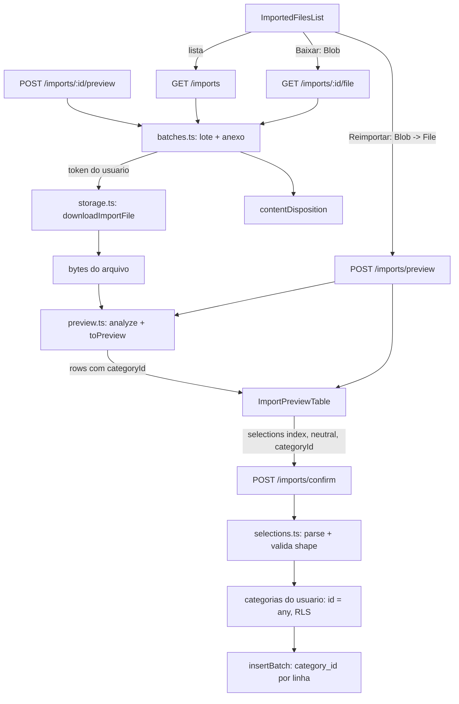

# Import: melhorias do preview e arquivos importados Design

**Spec**: `.specs/features/import-improvements/spec.md`
**Status**: Draft

---

## Architecture Overview

Duas frentes sobre o import que já existe (`analyze` -> `toPreview` / `insertBatch` -> web), sem migration:

1. **Preview e confirm (I1 a I4)**: a API passa a devolver `categoryId` por linha do preview e a aceitar `categoryId` opcional em cada item de `selections`; a validação de propriedade é uma consulta sob RLS dentro da transação que já reanalisa o arquivo. A tela ganha o select por linha, o checkbox "selecionar todas", o Valor colorido sem a coluna "Tipo" e o `AlertDialog` de duplicadas.
2. **Arquivos importados (I5)**: um módulo novo `batches.ts` registra `GET /imports`, `GET /imports/:id/file` e `POST /imports/:id/preview`. O arquivo é relido do bucket privado `imports` com o token do usuário (o helper de Storage ganha o download). O front lista os lotes, baixa o arquivo como `Blob` e, na reimportação, transforma esse `Blob` em `File` e entra no preview e no confirm normais.

Decisão central (reimportação): **um único caminho de confirm**. O confirm relê o arquivo da própria requisição multipart e nunca do Storage; oferecer um confirm "por id de lote" criaria uma segunda origem de arquivo (risco registrado no plano). Por isso o front baixa o arquivo por `GET /imports/:id/file` e reutiliza `POST /imports/preview` e `POST /imports/confirm`. `POST /imports/:id/preview` fica na API (contrato do plano, mesmo `analyze` do upload, para clientes futuros e testes de relido do Storage), mas a tela não o chama.

Decisões de `STATE.md` aplicadas: AD-001 (apps independentes: tipos do `web/` editados à mão, contrato é o `openapi.json` regenerado), AD-002 (toda leitura e a validação de categoria dentro de `request.withUser`, com RLS; o Storage com o token do usuário, nunca a chave de serviço), AD-004 (valores seguem strings decimais; o helper de valor do front trabalha com a string) e AD-005 (o preview de lote usa `request.tz`, como o preview do upload). Nenhuma decisão ativa é substituída; as escolhas novas (um só confirm, `storage_path` nunca sai da API) são locais da feature.

Lições confirmadas aplicadas: L-004 (a spec define como `categoryId` é comparado: UUID exato, sem caixa relevante, e como o nome do arquivo vira cabeçalho), L-006 (um único status para campo inválido: 422 `invalid_category` e 422 `validation_error` em `selections`; `limit` fora da faixa é 400 como nas outras listagens, por schema) e L-013 (cada falha de interface tem teste com o texto em português e as opções visíveis: erro da lista, erro do download, conta inativa na reimportação, categorias que falham ao carregar).



---

## Code Reuse Analysis

### Existing Components to Leverage

| Component | Location | How to Use |
| --------- | -------- | ---------- |
| `analyze`, `categoriesByKey`, `toPreview`, `PreviewSchema`, `invalidAccount` | `api/src/modules/import/routes.ts` | Movidos sem mudar comportamento para `preview.ts` para as duas origens de arquivo (upload e Storage) usarem o mesmo código |
| `parseSelections`, `selectedRows`, `insertBatch` | `api/src/modules/import/routes.ts` | `parseSelections` sai para `selections.ts` com `categoryId`; `selectedRows` e `insertBatch` passam a carregar a categoria resolvida por linha |
| `StorageAccess`, `objectUrl`, `headers`, `storageError`, `STORAGE_TIMEOUT_MS` | `api/src/modules/import/storage.ts` | `downloadImportFile` reaproveita URL, cabeçalhos, timeout e o erro 502 sem vazar URL |
| `withUser` e `AppError` | `api/src/plugins/db.ts`, `api/src/plugins/errors.ts` | Toda consulta sob RLS; erros `not_found`, `invalid_category`, `storage_not_configured` |
| Rotas de listagem com `querystring` TypeBox | `api/src/modules/accounts/routes.ts` | Mesma forma de `limit` e de resposta em array |
| Helpers de teste (`stack`, `db`, `fixtures`, `multipart`, `imports`, `storage`) e o esqueleto de `imports-isolation.int.test.ts` | `api/test/` | Mesmos usuários, contas, upload real no Storage local e limpeza |
| `CategorySelect`, `useCategories` | `web/src/features/categories/` | Select por linha; ganha `ariaLabel` e `className`; item vira `CategoryOptionLabel` |
| `previewSelection.ts` (`isSelectable`, `initialSelection`, `selectedPayload`) | `web/src/features/import/previewSelection.ts` | Estende com `categoryId`, estado do "selecionar todas" e contagem de duplicadas |
| `TransactionsPage.tsx` (classes e sinal do valor, linhas 597 e 658) | `web/src/features/transactions/TransactionsPage.tsx` | Fonte das classes de cor; passa a usar o helper compartilhado |
| `AlertDialog` | `web/src/components/ui/alert-dialog.tsx` | Diálogo de duplicadas |
| `Skeleton`, `Alert`, `Button` | `web/src/components/ui/` | Estados da lista |
| `apiRequest`, `ApiError`, `shouldMock`, `mockRequest` | `web/src/lib/api/client.ts`, `web/src/lib/api/mock/index.ts` | Base do cliente de Blob e dos mocks |
| `messageForError`, `importErrorMessage` | `web/src/lib/api/errorMessages.ts`, `web/src/features/import/errorMessages.ts` | Mensagens em português; sem texto da API |
| `formatLocalDate`, `formatDateLocal` | `web/src/features/import/labels.ts`, `web/src/lib/format.ts` | Data da lista |
| Padrão de teste de tela com `apiRequest` mockado | `web/src/features/import/ImportPage.test.tsx`, `useImport.test.tsx` | Mesma base dos testes novos |

### Integration Points

| System | Integration Method |
| ------ | ------------------ |
| Banco | Só leituras novas: `import_batches` join `accounts` join `attachments` (RLS por `user_id`); `categories` por `id` para validar propriedade; escrita só no `insertBatch` já existente, com `category_id` por linha |
| Storage `imports` | `GET {supabaseUrl}/storage/v1/object/imports/{path}` com `apikey` publicável e `Authorization: Bearer <token do usuário>`; a policy `imports_own_folder` exige a primeira pasta igual ao `auth.uid()` |
| `api/openapi.json` | Regenerado por `pnpm -C api openapi:export`; o teste de swagger confere |
| `POST /imports/preview` e `POST /imports/confirm` | Mesmos endpoints da reimportação no front; o confirm ganha `categoryId` opcional |

---

## Components

### Preview compartilhado (`preview.ts`)

- **Purpose**: Uma só implementação de "analisar o arquivo e montar o preview", usada pelo upload e pelo lote guardado.
- **Location**: `api/src/modules/import/preview.ts`
- **Interfaces**:
  - `PreviewSchema` / `PreviewRowSchema` (agora com `categoryId: string uuid`) e os tipos `Preview`, `PreviewRow`.
  - `analyze(tx, accountId, content, tz): Promise<Analysis>` - igual ao atual.
  - `categoriesByKey(tx, rows): Promise<Map<string, Category>>` - igual ao atual.
  - `toPreview(rows, categories): Preview` - passa a incluir `categoryId`.
  - `invalidAccount(): AppError`.
- **Dependencies**: `classify`, `parseImport`, `PAYMENT_METHODS`.
- **Reuses**: o código atual de `routes.ts` (movido, não reescrito).

### Seleções do confirm (`selections.ts`)

- **Purpose**: Validar o campo `selections` (forma e `categoryId`) com função pura, testável sem banco.
- **Location**: `api/src/modules/import/selections.ts`
- **Interfaces**:
  - `interface Selection { index: number; neutral: boolean; categoryId?: string }`
  - `parseSelections(raw: string): Selection[]` - mantém as regras de hoje (array não vazio, `index` inteiro >= 0 sem repetição, `neutral` booleano) e valida `categoryId` (omitido, ou string UUID; qualquer outro tipo ou valor é 422 `validation_error`, campo `selections`).
  - `categoryIdsOf(selections): string[]` - ids distintos informados, em minúsculas.
- **Dependencies**: `AppError`.
- **Reuses**: o `parseSelections` atual.

### Rotas do import (confirm com categoria)

- **Purpose**: Resolver a categoria de cada linha escolhida e gravá-la.
- **Location**: `api/src/modules/import/routes.ts`
- **Interfaces**:
  - `resolveCategories(tx, rows, selections): Promise<ChosenRow[]>` (função interna) - `ChosenRow = ClassifiedRow & { categoryId: string }`. Uma consulta `select id from public.categories where id = any(${ids}::uuid[])` (RLS) para os ids informados; qualquer id ausente do resultado lança `AppError('invalid_category', 422, 'Row N has a category that does not exist', 'selections')` com o `index` da primeira linha afetada; sem `categoryId`, usa o id da chave do parser (`categoriesByKey`).
  - `insertBatch` usa `r.categoryId` no lugar de `categories.get(r.categoryKey)`.
  - O schema do corpo do confirm (documentação) descreve `categoryId`.
- **Dependencies**: `selections.ts`, `preview.ts`.
- **Reuses**: o fluxo do confirm: analisa, escolhe, resolve categorias (agora com a validação), só então sobe o arquivo.

### Download no Storage

- **Purpose**: Ler um objeto do bucket com o token do usuário.
- **Location**: `api/src/modules/import/storage.ts`
- **Interfaces**:
  - `downloadImportFile(input: StorageAccess & { path: string }): Promise<Buffer | null>` - `GET` do objeto; `res.ok` devolve os bytes; HTTP 400 ou 404 devolve `null` (objeto ausente ou fora da policy: o Storage usa 400 com `statusCode: "404"`); qualquer outra resposta ou falha de rede e timeout lança `storageError('read', status?)` (502, sem URL, token nem caminho).
- **Dependencies**: `fetch`, `AbortSignal.timeout`.
- **Reuses**: `objectUrl`, `headers`, `storageError`, `STORAGE_TIMEOUT_MS`.

### Lotes importados (`batches.ts`)

- **Purpose**: As três rotas de arquivos importados, isoladas por usuário.
- **Location**: `api/src/modules/import/batches.ts`
- **Interfaces**:
  - `importedFilesRoutes(app, options: ImportRoutesOptions): Promise<void>` - registrada por `importRoutes`.
  - `GET /imports?limit=` -> `200 ImportBatch[]`. Consulta: `select b.id, b.bank, b.row_count, b.imported_count, b.skipped_count, b.created_at, a.filename, a.mime_type, a.size_bytes, c.id as account_id, c.nickname from import_batches b join accounts c on c.id = b.account_id join lateral (select ... from attachments where import_batch_id = b.id order by created_at asc, id asc limit 1) a on true order by b.created_at desc, b.id desc limit $1`. O `storage_path` nunca entra na lista de colunas da resposta.
  - `GET /imports/:id/file` -> `200 binary` (ou 404/502/503). Ordem: 503 se faltar `publishableKey`; `:id` não UUID ou lote ausente -> 404; leitura do Storage (`null` -> 404); cabeçalhos `Content-Type`, `Content-Disposition`, `Cache-Control: private, no-store`, `X-Content-Type-Options: nosniff`, `Content-Length`.
  - `POST /imports/:id/preview` -> `200 Preview` (ou 404/422/502/503). Mesma busca do lote e do anexo, leitura do Storage e `analyze(tx, batch.account_id, content, request.tz)` seguido de `toPreview`.
  - `contentDisposition(filename: string): string` (em `contentDisposition.ts`) - `attachment; filename="<fallback ASCII>"; filename*=UTF-8''<encodeURIComponent estendido>`; o fallback troca por `_` tudo fora de ASCII imprimível e as aspas e a barra invertida; CR, LF e controle são removidos.
- **Dependencies**: `withUser`, `preview.ts`, `storage.ts`, `contentDisposition.ts`.
- **Reuses**: `ImportRoutesOptions`, `UUID`, `AppError`.

### Estado de seleção do preview (web)

- **Purpose**: Concentrar em funções puras as regras de seleção, categoria e duplicadas.
- **Location**: `web/src/features/import/previewSelection.ts`
- **Interfaces**:
  - `RowChoice = { selected: boolean; neutral: boolean; categoryId: string }`.
  - `initialSelection(rows)` - `categoryId` inicial é o do preview; `selected` e `neutral` como hoje.
  - `selectedPayload(rows, selection): ImportSelection[]` - inclui `categoryId` (o efetivo).
  - `selectAllState(rows, selection): "all" | "some" | "none" | "disabled"` - sobre as linhas selecionáveis.
  - `setAllSelected(rows, selection, selected: boolean): PreviewSelection` - só `selected` das linhas selecionáveis.
  - `selectedDuplicateCount(rows, selection): number`.
- **Dependencies**: tipos de `@/lib/api/types`.
- **Reuses**: `isSelectable`, `initialSelection`, `selectedPayload` atuais.

### Tabela do preview (web)

- **Purpose**: Mostrar select de categoria, checkbox do cabeçalho e Valor colorido.
- **Location**: `web/src/features/import/ImportPreviewTable.tsx`
- **Interfaces**: mesmas props (`preview`, `selection`, `onSelectionChange`). Cabeçalho: `Checkbox` com `checked={state === "all" ? true : state === "some" ? "indeterminate" : false}` e `aria-label="Selecionar todas as linhas"`. Coluna Categoria: `CategorySelect` (por linha selecionável) com o `categoryId` da escolha, `ariaLabel` `Categoria de ${row.name}`; texto `categoryName` para `ignored` e `invalid`, e quando `useCategories` falha. Sem a coluna "Tipo". Valor: `className={amountClassName(row.type)}` e `formatSignedAmount(row.type, row.amount)`.
- **Dependencies**: `previewSelection.ts`, `CategorySelect`, helpers de valor.
- **Reuses**: o componente atual.

### Select de categoria e item (web)

- **Purpose**: Select reutilizável com o item isolado para a F4.
- **Location**: `web/src/features/categories/CategorySelect.tsx`
- **Interfaces**:
  - `CategorySelectProps` ganha `ariaLabel?: string` e `className?: string` (aplicados ao `SelectTrigger`).
  - `CategoryOptionLabel({ category }: { category: Category })` - hoje `<>{category.name}</>`; a F4 o troca pelo badge colorido; usado em cada `SelectItem` e no valor exibido.
- **Dependencies**: `useCategories`.
- **Reuses**: o `CategorySelect` atual (o extrato e os formulários continuam funcionando sem mudar).

### Helper de valor (web)

- **Purpose**: Uma fonte para a cor e o texto do valor assinado.
- **Location**: `web/src/features/transactions/utils.ts`
- **Interfaces**:
  - `amountClassName(type: TransactionType): string` - `"whitespace-nowrap font-semibold text-destructive"` para `Expense`; `"whitespace-nowrap font-semibold text-emerald-700 dark:text-emerald-400"` para `Income`.
  - `formatSignedAmount(type: TransactionType, amount: string): string` - despesa `-` + `formatBRL` do valor absoluto (tira um "-" inicial); receita `formatBRL` do valor.
- **Dependencies**: `formatBRL`.
- **Reuses**: as duas expressões atuais de `TransactionsPage.tsx`, que passam a chamar o helper.

### Diálogo de duplicadas (web)

- **Purpose**: Pedir confirmação quando há duplicadas selecionadas.
- **Location**: `web/src/features/import/DuplicateConfirmDialog.tsx`
- **Interfaces**: `DuplicateConfirmDialog({ open, count, onConfirm, onCancel, disabled })`. Título "Importar linhas duplicadas?"; descrição com singular e plural; `AlertDialogCancel` "Voltar" e `AlertDialogAction` "Importar mesmo assim" (desabilitado com `disabled`). `onOpenChange(false)` chama `onCancel`.
- **Dependencies**: `alert-dialog.tsx`.
- **Reuses**: o padrão de `AlertDialog` de exclusão de transações/categorias.

### Camada de dados dos arquivos importados (web)

- **Purpose**: Chamadas, hooks e blob do cliente.
- **Location**: `web/src/features/import/api.ts` (com `hooks` em `useImport.ts`)
- **Interfaces**:
  - `apiRequestBlob(path, options?): Promise<Blob>` em `web/src/lib/api/client.ts` - o mesmo caminho de `apiRequest` (token, `X-Timezone`, 401 e erros mapeados para `ApiError`) mas devolve `response.blob()`; em modo mock devolve o `Blob` do handler.
  - `listImports(limit?): Promise<ImportedFile[]>` - `GET /imports`.
  - `downloadImportFile(id): Promise<Blob>` - `GET /imports/:id/file`.
  - `previewImportBatch(id): Promise<ImportPreview>` - `POST /imports/:id/preview` (contrato; a tela não o usa).
  - `fileFromBlob(blob, file: ImportedFile): File` - `new File([blob], file.filename, { type: file.mimeType })`.
  - `useImportedFiles()` - `useQuery(["imports"])`; `useDownloadImport()` e `useReimportFile()` - `useMutation`; `useImportConfirm` invalida também `["imports"]`.
- **Dependencies**: `apiRequest`, `apiRequestBlob`.
- **Reuses**: `previewImport`, `useImportPreview` e `useImportConfirm` existentes.

### Lista de arquivos importados (web)

- **Purpose**: Seção "Arquivos importados" com estados de carregamento, vazio e erro.
- **Location**: `web/src/features/import/ImportedFilesList.tsx`
- **Interfaces**: `ImportedFilesList({ onReimport, reimportingId, reimportError })`. Internamente: consulta, `Skeleton` x3, vazio, erro com "Tentar novamente", linha por arquivo com "Baixar" (cria `URL.createObjectURL`, `<a download>` e `revokeObjectURL`) e "Reimportar" (chama `onReimport(file)`), botões da linha desabilitados enquanto a ação roda, alerta `role="alert"` com `messageForError(error, "import")`.
- **Dependencies**: `useImportedFiles`, `useDownloadImport`, `formatDateLocal`.
- **Reuses**: `Alert`, `Button`, `Skeleton`.

### Página de importação (web)

- **Purpose**: Ligar a lista e o diálogo ao fluxo existente.
- **Location**: `web/src/features/import/ImportPage.tsx`
- **Interfaces**: `reimport(file: ImportedFile)` - baixa o `Blob`, monta o `File`, `setAccountId(file.account.id)`, `setFile(...)` e chama `generatePreview` com esses valores (a função passa a aceitar o arquivo e a conta como argumento opcional); `confirm()` abre o diálogo se `selectedDuplicateCount > 0` e sempre envia direto no retry.
- **Dependencies**: os componentes acima.
- **Reuses**: o fluxo e os hooks atuais.

### Mocks e mensagens (web)

- **Purpose**: Mocks em memória do import e mensagens para os códigos novos.
- **Location**: `web/src/lib/api/mock/import.ts` (mais `index.ts` para a chave de área e `web/src/lib/api/errorMessages.ts`, `web/src/features/import/errorMessages.ts`)
- **Interfaces**: handlers `GET /imports`, `GET /imports/:id/file` (Blob CSV), `POST /imports/:id/preview`, `POST /imports/preview`, `POST /imports/confirm` (cria um lote novo no início da lista); `pathAreaMap` troca `import` por `imports`; mensagens `storage_error`, `storage_not_configured` (globais) e `invalid_category` (import).
- **Dependencies**: `mockApiError`, `listMockAccounts`, `listMockCategories`.
- **Reuses**: o padrão dos outros mocks (`MockHandler[]`).

---

## Data Models

Sem migration. Contratos novos:

```typescript
// api: preview row ganha categoryId
interface PreviewRow {
  index: number; localDate: string; type: 'Income' | 'Expense'; amount: string; name: string
  paymentMethod: PaymentMethod
  categoryId: string      // novo: categoria do usuário correspondente à chave do parser
  categoryName: string
  status: RowStatus; neutral: boolean; reason?: string
  counterpartyDocument: string | null; counterpartyBank: string | null
}

// api: item de selections
interface Selection { index: number; neutral: boolean; categoryId?: string }

// api e web: item de GET /imports
interface ImportedFile {
  id: string
  filename: string
  mimeType: string
  sizeBytes: number
  bank: string
  account: { id: string; nickname: string }
  createdAt: string        // ISO-8601, UTC
  rowCount: number
  importedCount: number
  skippedCount: number
}
```

```typescript
// web
type RowChoice = { selected: boolean; neutral: boolean; categoryId: string }
type ImportSelection = { index: number; neutral: boolean; categoryId?: string }
type PreviewRow = { /* ... */ categoryId: string; categoryName: string /* ... */ }
```

**Relationships**: `import_batches.account_id` -> `accounts` (apelido); `attachments.import_batch_id` -> `import_batches` (arquivo; `storage_path` só na API); `transactions.category_id` recebe a categoria resolvida por linha; objeto do Storage em `{userId}/{batchId}/{nome saneado}`.

---

## Error Handling Strategy

| Error Scenario | Handling | User Impact |
| -------------- | -------- | ----------- |
| `categoryId` malformado em `selections` | 422 `validation_error`, campo `selections` (`selections.ts`) | "Dados inválidos. Revise o arquivo e a conta" |
| `categoryId` que não é categoria do usuário | 422 `invalid_category`, campo `selections`, `index` na mensagem; antes do upload ao Storage | "Há linhas com categoria inválida. Gere a prévia de novo." |
| Lote inexistente, de outro usuário ou id inválido | 404 `not_found` idêntico, sem consultar o Storage | "Registro não encontrado. Atualize a página e tente de novo" |
| Objeto sumiu do Storage | Storage 400/404 vira 404 `not_found` | Mesma mensagem de não encontrado |
| Storage inacessível ou com erro | 502 `storage_error`, sem URL, token nem caminho | "Não foi possível acessar o arquivo guardado. Tente novamente." |
| Storage não configurado | 503 `storage_not_configured` | "O armazenamento de arquivos não está disponível no momento." |
| Conta do lote inativa na reimportação | 422 `invalid_account` do preview | "Selecione uma conta ativa" no formulário inicial |
| `limit` inválido em `GET /imports` | 400 `validation_error` por schema | Não ocorre pela tela (usa o padrão) |
| Falha ao listar arquivos | Alerta com `messageForError` e "Tentar novamente" | Mensagem em português e nova tentativa |
| Falha ao baixar ou ao ler o arquivo da reimportação | Alerta da lista com `messageForError`; sem preview | Mensagem em português; permanece no passo inicial |
| Falha das categorias no preview | Coluna cai para o `categoryName` em texto; confirm usa os `categoryId` do preview | A importação não é bloqueada |
| Categoria excluída entre prévia e confirm | 422 `invalid_category` | Mensagem pedindo para gerar a prévia de novo |
| Falha do confirm após o consentimento | `ImportFailure` com "Tentar novamente" (mesma chave, sem novo diálogo) | "Nada foi importado. Tente novamente." |

---

## Risks & Concerns

| Concern | Location (file:line) | Impact | Mitigation |
| ------- | -------------------- | ------ | ---------- |
| `routes.ts` já tem 441 linhas e concentra preview, confirm, formulário e transação; acrescentar três rotas e a validação de categoria o tornaria difícil de manter | `api/src/modules/import/routes.ts:27-441` | Mudança arriscada e revisão difícil | T1 extrai `preview.ts` sem mudar comportamento (testes existentes verdes, contagem igual) antes de qualquer feature; as rotas novas vão em `batches.ts` |
| O Storage responde 400 com `statusCode: "404"` para objeto ausente ou fora da policy (e o helper atual descarta o corpo) | `api/src/modules/import/storage.ts:58-67` | Confundir "sumiu" com erro do cliente ou vazar status do Storage | `downloadImportFile` trata 400 e 404 como "ausente" (`null` -> 404) e todo o resto como 502; teste unitário por status e teste de integração com objeto removido (service key só no teste) |
| O download guarda até 5 MB em memória por requisição | `api/src/modules/import/batches.ts` (novo) | Uso de memória sob várias requisições simultâneas | O upload já limita a 5 MB; sem streaming por simplicidade; `Cache-Control: no-store`; aceito para o volume do projeto |
| Nome original do arquivo vem do cliente e vai para o `Content-Disposition` | `api/src/modules/import/routes.ts:153` (`filename` do upload) | Injeção de cabeçalho (CR/LF) ou cabeçalho inválido derrubando a resposta | `contentDisposition` remove controle e CR/LF do fallback e percent-codifica o `filename*`; teste unitário com aspas, acento, CR/LF e nome vazio |
| O `mime_type` guardado vem do cliente | `api/src/modules/import/routes.ts:407` | `Content-Type` inválido ou perigoso | Só o formato `tipo/subtipo` é usado; senão `application/octet-stream`, com `nosniff` |
| `POST /imports/:id/preview` não é usada pela tela | `api/src/modules/import/batches.ts` (novo) | Rota sem consumidor pode apodrecer | Mantida pelo plano e coberta por teste de integração (mesmo resultado do preview do upload, linha a linha); o front documenta por que usa o caminho normal; remover a rota é um corte barato se o dono preferir |
| O mapa de áreas dos mocks usa `import`, mas o caminho real é `/imports/...`; os handlers de import estão vazios | `web/src/lib/api/mock/index.ts:33`; `web/src/lib/api/mock/import.ts:3` | Com `VITE_MOCK_AREAS=import` nada é simulado; com `*` o import quebra | T12 troca a chave, adiciona handlers e testa `areaFromPath("/imports/preview")` e cada handler |
| Cada linha do preview terá um `Select` (até centenas de linhas) e todos consultam `useCategories` | `web/src/features/import/ImportPreviewTable.tsx` | Renderização lenta com arquivos grandes | `useCategories` é uma única consulta em cache compartilhada; o conteúdo do Select do shadcn (Radix) só monta ao abrir; sem virtualização (fora do escopo) |
| A escolha de categoria vive junto de `selected` e `neutral` no mesmo estado | `web/src/features/import/previewSelection.ts:15` | Esquecer `categoryId` em `initialSelection` envia categoria vazia | `categoryId` é obrigatório em `RowChoice`; teste unitário do payload com categoria padrão e escolhida |
| O fallback de `update` na tabela usa `neutral` do preview para linhas fora de `selection` | `web/src/features/import/ImportPreviewTable.tsx:50` | Linha fora da seleção perderia `categoryId` | O fallback passa a incluir `categoryId: row.categoryId`; teste de edição de uma linha ausente da seleção |
| A categoria pode ser excluída entre a prévia e o confirm | `api/src/modules/import/routes.ts` (confirm) | 422 inesperado | Tratado: 422 `invalid_category` com mensagem pedindo nova prévia; sem gravação parcial |
| Reimportar gera um objeto e um lote novos, e a chave de idempotência é por sessão de prévia | `web/src/features/import/useImport.ts:17-27` | Confirmar duas vezes em abas diferentes duplica | Regra já existente do confirm (risco do plano mantido); o diálogo de duplicadas avisa o usuário na reimportação |
| Lista de arquivos sem índice em `(user_id, created_at)` | `supabase/migrations/0004_imports.sql:5-20` | Ordenação lenta se um usuário tiver milhares de lotes | Volume por usuário é pequeno e `limit` máximo é 100; migration só se aparecer necessidade (fora de escopo) |
| `ImportPage.test.tsx` mocka `apiRequest` e `AccountSelect`; os testes novos precisam de `apiRequestBlob` | `web/src/features/import/ImportPage.test.tsx:7-12` | Testes de reimportação sem cobertura do blob | T11 e T13 estendem o mock com `apiRequestBlob` e conferem o `File` enviado ao preview |

---

## Tech Decisions (only non-obvious ones)

| Decision | Choice | Rationale |
| -------- | ------ | --------- |
| Como reimportar | Blob de `GET /imports/:id/file` -> `File` -> `POST /imports/preview` e `POST /imports/confirm` | Um único confirm, que relê o arquivo da requisição; evita segunda origem de arquivo |
| `POST /imports/:id/preview` | Implementada, não usada pela tela | Contrato do plano; mesmo `analyze`; custo baixo de manter |
| `categoryId` ausente no confirm | Vale a categoria do parser | Contrato aditivo; clientes antigos não quebram |
| Validação de categoria | Consulta `id = any(...)` sob RLS, antes do upload ao Storage | RLS decide a propriedade; a falha não deixa objeto órfão |
| Erro de categoria | 422 `invalid_category`, campo `selections` | L-006 (422 para dado inválido); código próprio para mensagem em português |
| Extração de `preview.ts` | Mover sem mudar comportamento, primeiro | Duas origens de arquivo precisam do mesmo `analyze` e `toPreview` |
| Rotas de arquivos em `batches.ts` | Módulo e registro próprios | `routes.ts` já é grande; limite de responsabilidade |
| Download em memória | `Buffer` com `Content-Length`, sem streaming | Arquivo limitado a 5 MB; mais simples e testável |
| Missing no Storage | 400 e 404 viram `null` -> 404; resto 502 | O Storage usa 400 para ausente; a rota distingue "sumiu" de "indisponível" |
| `GET /imports` | Array simples com `limit` (1 a 100, padrão 50), sem cursor | Forma igual a `GET /accounts`; volume pequeno |
| Join do anexo | `join lateral ... limit 1` pelo mais antigo | Robusto a mais de um anexo e a ordem determinística |
| Classes do Valor | Helper em `transactions/utils.ts` usado pelo extrato e pelo preview | Uma fonte; o extrato não muda visualmente |
| Estado do checkbox do cabeçalho | Função pura `selectAllState` e `setAllSelected` | Testável sem render; indeterminado vira "todas" ao clicar |
| Item do select | `CategoryOptionLabel` único | A F4 troca por badge em um só lugar |
| Retry do confirm | Sem novo diálogo | O consentimento já foi dado para a tentativa |
| Download no navegador | `fetch` autenticado, Blob, `URL.createObjectURL`, `<a download>`, `revokeObjectURL` | O token nunca vai em URL; sem expor o caminho do Storage |
| Mocks de `/imports` | Handlers em memória e chave de área `imports` | Hoje vazio e com chave que não casa |
| Sem alterar `STATE.md` | Decisões são locais da feature | Nenhuma convenção nova de projeto que outras features devam herdar além das já registradas (AD-001, AD-002) |
