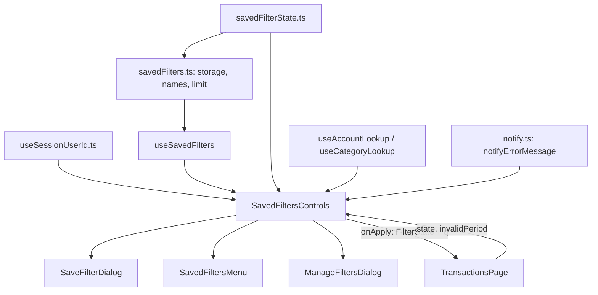

# Extrato: filtros salvos Design

**Spec**: `.specs/features/saved-filters/spec.md`
**Status**: Approved

---

## Architecture Overview

Só `web/`. Dois módulos puros, sem React, concentram as regras: `savedFilterState.ts` (o estado salvo: conversão de e para o `FilterState` do extrato, igualdade, "sem filtro", conta e categoria ausentes, linhas de resumo) e `savedFilters.ts` (o armazenamento: chave por usuário, JSON versionado, validação de tudo o que se lê, nomes, limite e as três ações, todas em `try/catch`). O hook `useSavedFilters(userId)` entrega a lista ordenada e as ações à tela, e `useSessionUserId()` (novo, em `useSessionUserId.ts`, com o contexto movido para `sessionContext.ts`) dá o id sem lançar fora do provedor. Três componentes de apresentação (`SaveFilterDialog`, `SavedFiltersMenu`, `ManageFiltersDialog`) não conhecem o armazenamento: recebem a lista e funções que devolvem o resultado. `SavedFiltersControls` junta tudo (usuário, hook, listas de contas e categorias em cache, toasts, marcador) e é a única coisa que `TransactionsPage.tsx` importa; a página só ganha a montagem e uma função `applySaved` (estado novo e texto da busca).

Decisões de `STATE.md` aplicadas: AD-001 (apps independentes; nada de API aqui), AD-004 (dinheiro como texto; os filtros salvos não têm valores monetários). Nenhuma decisão ativa é substituída. Uma nova entra: AD-006, a convenção do que o navegador guarda (chave com o prefixo `financials:`, por usuário quando o dado é do usuário, JSON versionado validado na leitura, todo acesso em `try/catch`), porque as próximas preferências de tela vão seguir o mesmo caminho.

Lições aplicadas: L-004 (igualdade dos nomes definida na spec e testada com caixa, acento e espaços), L-013 (a falha de cada ação destrutiva com texto e opções visíveis), L-027 (testes leves: os módulos e os diálogos são testados isolados; a página só nos poucos fluxos que dependem dela, com `lightList`), L-041 (aplicar e salvar partem da página 2), L-043 (a chave literal afirmada), L-040 (cor pintada conferida em Chromium real), L-020 (relógio falso, sem espera fixa).



---

## Code Reuse Analysis

### Existing Components to Leverage

| Component | Location | How to Use |
| --------- | -------- | ---------- |
| `FilterState`, `QuickMonth`, `monthRange` | `web/src/features/transactions/utils.ts` | O estado salvo é derivado de `FilterState`; `monthRange` deriva De e Até do mês rápido, na ida e na volta |
| `TransactionFilters` | `web/src/lib/api/types.ts` | Tipos de `type`, `sort` e `order` do estado salvo |
| `baseFilters`/`initialState` | `web/src/features/transactions/TransactionsPage.tsx` | A volta do estado salvo produz `{ sort: "date", order: "desc", page: 1, ... }` igual ao inicial; `isDefaultState` compara contra o mesmo formato |
| `usePageSize` e `readStoredPageSize` | `web/src/features/transactions/usePageSize.ts` | Modelo do `try/catch` em volta do `localStorage` e do prefixo `financials:transactions:`; o tamanho continua fora do estado |
| `useAccountLookup`, `useCategoryLookup` | `web/src/features/accounts/hooks.ts`, `web/src/features/categories/hooks.ts` | `byId` e `ready` de todas as contas (inclusive inativas) e de todas as categorias, para os ids ausentes e para os nomes do resumo; sem consulta nova (o extrato já as carrega) |
| `useSession` e `SessionContext` | `web/src/features/auth/useSession.tsx` | O contexto passa para `sessionContext.ts` (sem mudar o comportamento de `useSession`) e `useSessionUserId` o lê sem lançar |
| `Dialog`, `AlertDialog`, `DropdownMenu`, `Button`, `Input`, `Label` | `web/src/components/ui/` | Diálogos e menu do app, com foco e teclado do Radix |
| `ClearButton` e o padrão de `FilterField` | `web/src/features/transactions/FilterField.tsx` | Mesmo estilo de botão pequeno e de rótulo |
| `notifySuccess`, `notifyInfo`, `notifyError` | `web/src/lib/notify.ts` | Toasts coloridos já existentes; `notifyErrorMessage(texto)` é o único acréscimo |
| Padrão da exclusão de transação | `web/src/features/transactions/TransactionsPage.tsx` (AlertDialog com `preventDefault`) | A exclusão do filtro mantém o diálogo aberto quando falha |
| `lightList`, `trimTransactions`, `fakeClock`, `listPaths`, `lastListParams`, `chooseOption` | `web/src/test/extratoKit.ts` | Testes de página leves (três linhas) e leitura exata dos parâmetros |
| `apiSpy`, `pickDate` | `web/src/test/apiSpy.tsx`, `web/src/test/datePicker.ts` | Registro de requisições e escolha de data sem o menu de mês |
| `colorContrast.ts` | `web/src/test/colorContrast.ts` | Só se a medição em Chromium achar um estilo a proteger por teste (L-040); não há cor nova no módulo |

### Integration Points

| System | Integration Method |
| ------ | ------------------ |
| `TransactionsPage` | Renderiza `<SavedFiltersControls state={{ filters, quick }} invalidPeriod={invalidPeriod} onApply={applySaved} />` na seção de filtros, e `applySaved(next)` faz `setState(next)` e `setSearch(next.filters.q ?? "")` |
| `localStorage` | Uma chave por usuário (`financials:transactions:saved-filters:<id>`); nada mais é lido nem gravado |
| Sessão Supabase | `session.user.id` pelo `SessionContext`; sem provedor ou sem sessão, o controle não aparece |
| API | Nenhuma; aplicar muda o estado e as consultas de lista e de resumo saem como em qualquer mudança de filtro |

---

## Components

### `savedFilterState.ts`

- **Purpose**: o estado do filtro salvo e tudo o que é regra sobre ele, sem React e sem armazenamento.
- **Location**: `web/src/features/transactions/savedFilterState.ts`
- **Interfaces**:
  - `type SavedFilterState` - os dez campos (abaixo)
  - `toSavedState(state: FilterState): SavedFilterState` - sem página e sem tamanho; `q` aparado; mês completo vira `quick` com `from`/`to` do mês
  - `toFilterState(saved: SavedFilterState): FilterState` - página 1, `sort`/`order` com padrão, `quick` e `from`/`to` do mês
  - `sanitizeSavedState(raw: unknown): SavedFilterState` - valida campo a campo (spec, "Leitura: campo do estado inválido"); desconhecidos e inválidos somem
  - `isDefaultState(saved: SavedFilterState): boolean`
  - `sameSavedState(a, b: SavedFilterState): boolean` - compara as formas normalizadas
  - `withoutMissingRefs(saved, known: { accountIds?: ReadonlySet<string>; categoryIds?: ReadonlySet<string> }): { state: SavedFilterState; missing: Array<"account" \| "category"> }`
  - `describeSavedState(saved, names: { account?: string; category?: string }): string[]` - linhas do resumo
- **Dependencies**: `utils.ts` (`monthRange`, tipos), `types.ts`.
- **Reuses**: `monthRange`, `FilterState`.

### `savedFilters.ts`

- **Purpose**: o armazenamento no `localStorage` com validação, nomes, limite e as ações.
- **Location**: `web/src/features/transactions/savedFilters.ts`
- **Interfaces**:
  - `savedFiltersKey(userId: string): string` e as constantes `SAVED_FILTERS_VERSION = 1`, `MAX_SAVED_FILTERS = 20`, `MAX_FILTER_NAME_LENGTH = 40`
  - `type SavedFilter = { id: string; name: string; state: SavedFilterState }`
  - `type SavedFilterFailure = "invalid-name" \| "duplicate-name" \| "limit" \| "not-found" \| "storage"`
  - `type SavedFilterResult = { ok: true; filter?: SavedFilter } \| { ok: false; reason: SavedFilterFailure; message: string }`
  - `normalizeFilterName(name: string): string` - NFD sem marcas, minúsculas `pt-BR`, espaços colapsados, aparado
  - `readSavedFilters(userId: string): { available: boolean; filters: SavedFilter[] }`
  - `addSavedFilter(userId, name, state): SavedFilterResult`, `renameSavedFilter(userId, id, name): SavedFilterResult`, `deleteSavedFilter(userId, id): SavedFilterResult`
  - `sortSavedFilters(filters: SavedFilter[]): SavedFilter[]` - alfabética (`pt-BR`, `base`), estável
  - `FILTER_MESSAGES` - os textos de erro (vazio, tamanho, repetido, limite, armazenamento, não encontrado)
- **Dependencies**: `savedFilterState.ts` (`sanitizeSavedState`).
- **Reuses**: o formato de `try/catch` de `usePageSize.ts`.

### `useSessionUserId`

- **Purpose**: o id do usuário logado ou `null`, sem lançar fora do provedor.
- **Location**: `web/src/features/auth/useSessionUserId.ts` (e `sessionContext.ts`, que recebe o contexto e os tipos que estavam em `useSession.tsx`)
- **Interfaces**: `useSessionUserId(): string | null`
- **Dependencies**: `SessionContext`.
- **Reuses**: o contexto de `useSession`.

### `useSavedFilters`

- **Purpose**: lista ordenada, `available`, `atLimit` e as ações que releem depois de cada chamada.
- **Location**: `web/src/features/transactions/useSavedFilters.ts`
- **Interfaces**: `useSavedFilters(userId: string | null): { filters: SavedFilter[]; available: boolean; atLimit: boolean; add(name, state): SavedFilterResult; rename(id, name): SavedFilterResult; remove(id): SavedFilterResult }`
- **Dependencies**: `savedFilters.ts`.
- **Reuses**: `usePageSize.ts` como forma (estado local mais armazenamento); a lista é derivada com `useMemo` de `[userId, version]` e a ação só incrementa `version`.

### `SaveFilterDialog`

- **Purpose**: diálogo de nome com o resumo do que será salvo.
- **Location**: `web/src/features/transactions/SaveFilterDialog.tsx`
- **Interfaces**: `SaveFilterDialog({ open, onOpenChange, lines: string[], atLimit: boolean, onSave: (name: string) => SavedFilterResult })`
- **Dependencies**: `Dialog`, `Input`, `Label`, `Button`, `FILTER_MESSAGES`.
- **Reuses**: o padrão de foco (`onOpenAutoFocus`) e de erro (`role="alert"`, `aria-invalid`, `aria-describedby`) dos formulários do app.

### `SavedFiltersMenu`

- **Purpose**: o botão "Filtros salvos" com o menu, o estado vazio e o marcador.
- **Location**: `web/src/features/transactions/SavedFiltersMenu.tsx`
- **Interfaces**: `SavedFiltersMenu({ filters: SavedFilter[]; appliedIds: ReadonlySet<string>; onApply: (filter: SavedFilter) => void; onManage: () => void })`
- **Dependencies**: `DropdownMenu*`, `Button`, ícones `lucide-react`.
- **Reuses**: `web/src/components/ui/dropdown-menu.tsx`.

### `ManageFiltersDialog`

- **Purpose**: renomear (inline) e excluir (confirmação) filtros.
- **Location**: `web/src/features/transactions/ManageFiltersDialog.tsx`
- **Interfaces**: `ManageFiltersDialog({ open, onOpenChange, filters: SavedFilter[]; onRename: (id, name) => SavedFilterResult; onDelete: (id) => SavedFilterResult })`
- **Dependencies**: `Dialog`, `AlertDialog`, `Input`, `Button`.
- **Reuses**: o padrão do `AlertDialog` da exclusão de transação (falha mantém o diálogo aberto).

### `SavedFiltersControls`

- **Purpose**: liga usuário, hook, listas em cache, toasts, marcador e aplicação; é o único ponto de contato com a página.
- **Location**: `web/src/features/transactions/SavedFiltersControls.tsx`
- **Interfaces**: `SavedFiltersControls({ state: FilterState; invalidPeriod: boolean; onApply: (next: FilterState) => void })`; devolve `null` sem id de usuário
- **Dependencies**: `useSessionUserId`, `useSavedFilters`, os três componentes, `savedFilterState.ts`, `useAccountLookup`, `useCategoryLookup`, `notify.ts`.
- **Reuses**: `useAccountLookup`, `useCategoryLookup`.

### `notifyErrorMessage`

- **Purpose**: toast de erro com texto próprio (a mensagem do armazenamento), já que `notifyError` só traduz erros da API.
- **Location**: `web/src/lib/notify.ts`
- **Interfaces**: `notifyErrorMessage(message: string): void`
- **Reuses**: `toast.error`.

### Extrato: montagem

- **Purpose**: renderizar `SavedFiltersControls` na seção de filtros e aplicar o estado devolvido.
- **Location**: `web/src/features/transactions/TransactionsPage.tsx`
- **Interfaces**: `applySaved(next: FilterState)`
- **Dependencies**: `SavedFiltersControls`.
- **Reuses**: `setState`, `setSearch`.

---

## Data Models

Sem API e sem migration. Formato no `localStorage`:

```typescript
// texto JSON na chave `financials:transactions:saved-filters:<userId>`
type Stored = {
  version: 1;
  filters: Array<{ id: string; name: string; state: SavedFilterState }>;
};

type SavedFilterState = {
  q?: string;                      // busca aplicada, aparada, até 200 caracteres
  type?: "Income" | "Expense";
  accountId?: string;
  categoryId?: string;
  neutral?: boolean;               // false é um valor (Neutra = Não)
  from?: string;                   // AAAA-MM-DD; ignorado quando há `quick`
  to?: string;
  quick?: { year: number; month: number }; // só completo; 1900-2100 e 1-12
  sort: "date" | "name" | "amount" | "category"; // padrão "date"
  order: "asc" | "desc";           // padrão "desc"
};
```

**Relationships**: `accountId` e `categoryId` apontam para contas e categorias da API (podem deixar de existir; a aplicação descarta e avisa). `state` é o `FilterState` do extrato sem `page`, sem `pageSize` e com `from`/`to` derivados do mês quando há mês rápido.

---

## Error Handling Strategy

| Error Scenario | Handling | User Impact |
| -------------- | -------- | ----------- |
| Valor guardado não é JSON, não é objeto, `filters` não é lista ou `version` diferente de 1 | Lista vazia, sem erro | Menu vazio; a próxima gravação boa sobrescreve |
| Entrada ou campo inválido | A entrada ruim é descartada; campo ruim vira ausente | O resto aparece normalmente |
| `localStorage` lança ao ler | `available: false`, lista vazia; ações falham com `storage` sem gravar | Toast de erro ao tentar salvar, renomear ou excluir |
| `localStorage` lança ao gravar (cota, bloqueado) | A ação falha com `storage`; a lista fica como estava | Toast de erro; o diálogo de salvar fica aberto com o nome |
| Nome vazio, longo, repetido ou limite | Falha com a razão e a mensagem | Mensagem sob o campo (ou alerta de limite no diálogo) |
| Filtro sumiu (outra aba) | `not-found`; o hook relê | Toast "Esse filtro não existe mais" e a lista atual |
| Conta ou categoria do filtro não existem mais | Descartadas do estado aplicado; o resto é aplicado | Toast informativo |
| Listas de contas e categorias não carregadas | Aplica tudo, sem checar | Sem aviso (a lista pode vir vazia de um nome inexistente) |
| Sem id de usuário | `SavedFiltersControls` devolve `null` | Os botões não aparecem |

---

## Risks & Concerns

| Concern | Location (file:line) | Impact | Mitigation |
| ------- | -------------------- | ------ | ---------- |
| `TransactionsPage.tsx` tem 740 linhas e várias responsabilidades | `web/src/features/transactions/TransactionsPage.tsx:1` | Os filtros salvos engordariam o arquivo | Tudo vive em arquivos próprios; a página ganha só o import, a montagem e `applySaved` (meta: no máximo 765 linhas) |
| `useSession` lança fora do `SessionProvider` | `web/src/features/auth/useSession.tsx:70` | Todo teste atual do extrato (sem provedor) quebraria se a página o chamasse | `useSessionUserId` lê o contexto sem lançar e devolve `null`; sem id nada é renderizado; os testes de filtros salvos simulam o módulo `useSession` |
| `notifyError` só traduz erros da API e devolve a mensagem genérica para o resto | `web/src/lib/notify.ts:13` | Falha do armazenamento mostraria "Não foi possível concluir a operação" | `notifyErrorMessage(texto)` usa o mesmo `toast.error` (cor e estilo iguais); teste do toast com a mensagem exata |
| A busca tem dois estados (campo e `filters.q`) e uma espera de 300 ms | `web/src/features/transactions/TransactionsPage.tsx:127` | Aplicar um filtro deixaria a busca antiga voltar ou consultaria duas vezes | `applySaved` troca `state` e `search` juntos; o efeito da espera vê o mesmo `q` e não muda nada; teste com relógio falso conta as consultas depois de 300 ms |
| Mês rápido incompleto convive com De e Até digitados | `web/src/features/transactions/TransactionsPage.tsx:154` | Guardar o mês parcial daria dois estados iguais na consulta e diferentes na comparação | Só o mês completo é guardado e comparado; o parcial é ignorado em `toSavedState`, `isDefaultState` e `sameSavedState` |
| `localStorage` com dado de outra versão ou corrompido | `web/src/features/transactions/savedFilters.ts` | Quebrar a tela ou perder dados | Validação de tudo o que se lê; ação com leitura impossível não grava; formato com `version`; versão diferente é ignorada (e sobrescrita na próxima gravação, aceito até existir a versão 2) |
| Várias abas gravando a mesma chave | `web/src/features/transactions/savedFilters.ts` | Uma aba sobrescreve o que a outra salvou | Toda ação relê antes de gravar; a janela entre ler e gravar é a de um `setItem` síncrono |
| O `DropdownMenu` do Radix abre por `pointerdown` e o jsdom não tem `PointerEvent`; abrir um diálogo a partir de um item do menu mexe no foco | `web/src/components/ui/dropdown-menu.tsx` | Testes que não abrem o menu, ou o foco que não volta ao botão | Os testes abrem o menu pelo teclado (Enter), o que também prova a acessibilidade; o diálogo "Gerenciar" é irmão do menu (não filho) e o foco de retorno é afirmado; conferência em Chromium real |
| Testes de página são pesados em jsdom (L-027) | `web/src/features/transactions/*.test.tsx` | Suíte vermelha quando duas rodam juntas | Módulos, hook e diálogos testados isolados; só poucos testes montam a página, todos com `lightList`; medição de duas suítes em paralelo na task final |
| Cor pintada só se prova em navegador real (L-040) | `web/src/components/ui/dropdown-menu.tsx`, `dialog.tsx` | Classes certas e nada legível | Página Vite descartável em Chromium, sem login, medindo a cor pintada do menu, do marcador e dos diálogos nos dois temas |
| A lista de contas pode estar carregando quando o filtro é aplicado | `web/src/features/accounts/hooks.ts:11` | Aplicar um id ausente sem avisar | `ready` falso aplica tudo sem aviso (decisão da spec); a consulta da lista com id ausente simplesmente devolve vazio, como hoje |

---

## Tech Decisions (only non-obvious ones)

| Decision | Choice | Rationale |
| -------- | ------ | --------- |
| Dois módulos puros em vez de um | `savedFilterState.ts` (regras do estado) e `savedFilters.ts` (armazenamento) | O estado é testado sem `localStorage` e o armazenamento sem React; cada um fica pequeno |
| Lista derivada de `[userId, version]` com `useMemo` | A leitura do `localStorage` é síncrona e barata; a ação só incrementa `version` | Sem efeito, sem estado duplicado e sem dessincronizar com o armazenamento |
| Resultado em vez de exceção | `SavedFilterResult` com `reason` e `message` | A tela decide entre erro no campo e toast pela razão; nada lança |
| Ação com leitura impossível não grava | `storage` sem escrever | Nunca sobrescrever o que não foi possível ler |
| Estado salvo sem `from`/`to` do mês | `quick` é a fonte; De e Até vêm de `monthRange` | Um valor só para a mesma coisa |
| Aviso de conta ou categoria ausente em vez de marcar o filtro como desatualizado | Aplica o resto e avisa por toast | Sem estado novo no armazenamento e sem ícone de alerta na lista |
| Componentes de apresentação recebem funções que devolvem resultado | O armazenamento e os toasts ficam em `SavedFiltersControls` | Os diálogos se testam isolados com o hook real num arranjo pequeno |
| Posição dos botões | Célula própria depois do mês rápido | Uma coluna de 1/7 não comporta três botões; mesma seção e mesma linha no layout largo |
| `useSessionUserId` novo em vez de tornar `useSession` tolerante | Função nova e pequena, em arquivo próprio, com o contexto extraído para `sessionContext.ts` | Não muda o contrato de `useSession`, que lançar fora do provedor é proposital; um segundo export de função em `useSession.tsx` criaria um aviso novo de `react-refresh/only-export-components` (o arquivo já tem um) |
| Menu de Radix com `DropdownMenu` e não `Popover` | `DropdownMenu` | Papéis `menu` e `menuitem`, setas, Esc e foco prontos; um popover exigiria reimplementar a lista navegável |
