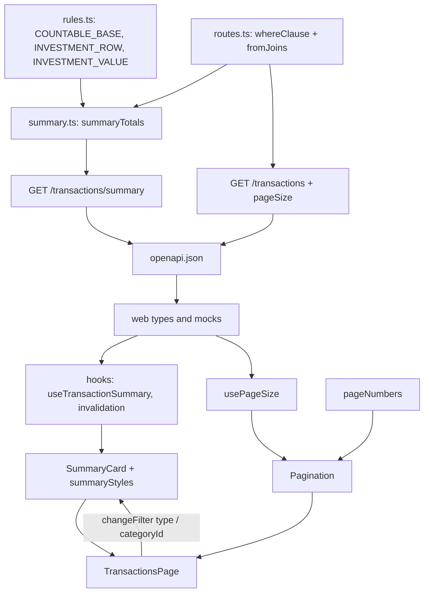

# Extrato: resumo e paginação Design

**Spec**: `.specs/features/transactions-list/spec.md`
**Status**: Approved

---

## Architecture Overview

Na API, o resumo é uma consulta de agregação sobre a mesma junção e a mesma cláusula `where` da listagem, com os fragmentos SQL de `rules.ts` (AD-003); `pageSize` entra como um parâmetro validado do `limit`. No `web/`, o resumo é uma query própria (`["transaction-summary", filtros]`) lida por `SummaryCard`, que também aplica os filtros rápidos pelos mesmos tratadores do extrato; `Pagination` e `usePageSize` substituem o rodapé. `TransactionsPage.tsx` (741 linhas) só importa os três componentes e perde o rodapé.

Decisões de `STATE.md` aplicadas: AD-001 (apps independentes; tipos e mocks do web seguem o `openapi.json`), AD-002 (resumo dentro de `withUser`, RLS), AD-003 (todo cálculo de regra nos fragmentos de `rules.ts`; o resumo só os referencia; o guarda `rules.guard.test.ts` continua sem exceção), AD-004 (dinheiro `numeric(14,2)` no banco e string decimal na API e no web; sem `number`) e AD-005 (`from` e `to` são dias locais de `X-Timezone`). Nenhuma decisão ativa é substituída e nenhuma nova é necessária: os padrões novos são locais à feature.

Lições aplicadas: L-006 (422 para valor semântico inválido, inclusive `pageSize`), L-013 e L-024 (texto em português e lista exata de opções), L-014 e L-015 (linhas nas bordas e só futuras), L-021 e L-041 (todo teste de volta à página 1 parte da página 2), L-020 e L-027 (relógio e temporizadores falsos, sem espera fixa, sem timeout aumentado, helpers leves) e L-023 (conteúdo do OpenAPI afirmado).



---

## Code Reuse Analysis

### Existing Components to Leverage

| Component | Location | How to Use |
| --------- | -------- | ---------- |
| `COUNTABLE`, `INCOME_VALUE`, `EXPENSE_VALUE`, `CARD_VALUE`, `rule()` | `api/src/modules/dashboards/rules.ts` | O resumo embute os fragmentos com `rule(tx, ...)`; `COUNTABLE` é recomposto de `COUNTABLE_BASE`; `INVESTMENT_ROW` e `INVESTMENT_VALUE` são novos e seguem o precedente de `CARD_VALUE` |
| `whereClause`, `Filters`, `ListQuery`, `validPage`, `fromJoins` | `api/src/modules/transactions/routes.ts` e `schema.ts` | `whereClause` fica em `routes.ts`, que a usa nas duas rotas e entrega o `where` pronto a `summaryTotals`; `validPageSize` nasce ao lado de `validPage` |
| `rules.guard.test.ts` | `api/src/modules/dashboards/` | Já falha se `'Investments'`, `'Reversal'` ou `'CreditCard'` aparecem em SQL fora de `rules.ts`; garante AC 17 do resumo sem mudança |
| `dashboards-rules.int.test.ts`, `helpers/dashboards.ts` | `api/test/` | `DATASET`, `asUser`, `seedTransactions`, `seedAccount` e a consulta de totais são o modelo e a fonte da comparação com o dashboard |
| Blocos `GET /transactions` e `auth` | `api/test/transactions.int.test.ts` | Modelo de `call`, `seed`, isolamento e checagem de 401 |
| `swagger.int.test.ts` | `api/test/` | Bloco novo afirma o conteúdo do documento; o teste de exportação já exige o arquivo atualizado |
| `useTransactions`, `transactionsQueryOptions`, mutations | `web/src/features/transactions/hooks.ts` | O resumo segue o padrão; as mutations passam a invalidar também `["transaction-summary"]` |
| `changeFilter`, `withFilters`, `FilterState` | `web/src/features/transactions/TransactionsPage.tsx` | O clique nos valores chama `changeFilter("type" \| "categoryId", valor)`, que já volta à página 1 e preserva `sort` e `order` |
| `useCategories` | `web/src/features/categories/hooks.ts` | Fonte da categoria de chave `Investments` (lista em cache) |
| `formatBRL` | `web/src/lib/format.ts` | Formata as strings da API sem aritmética |
| `Select`, `Button` | `web/src/components/ui/` | Seletor de itens por página e botões da paginação |
| `colorContrast.ts` e o padrão de `toast-styles.test.ts` | `web/src/test/`, `web/src/components/ui/` | Cálculo OKLCH para contraste lido de `tailwindcss/theme.css` e `styles.css` |
| `apiSpy.tsx`, `datePicker.ts`, `lightList` | `web/src/test/`, `extratoClearFilters.test.tsx` | Registro de requisições, respostas fixas e relógio falso; a regex de rota do `routeKey` ganha `summary` |
| Mock de transações | `web/src/lib/api/mock/transactions.ts` | Ganha `pageSize` e o handler do resumo, reaproveitando o filtro da listagem extraído numa função |
| Testes `extrato*.test.tsx` | `web/src/features/transactions/` | Seguem passando: o texto "N transações · Página X de Y" e os botões "Anterior"/"Próxima" são preservados |

### Integration Points

| System | Integration Method |
| ------ | ------------------ |
| `GET /transactions` | Ganha `pageSize` opcional na consulta e a resposta devolve o usado |
| `GET /transactions/summary` | Rota nova no módulo `transactions`, mesma autenticação e mesmo `withUser` |
| `api/openapi.json` | Regenerado por `pnpm -C api openapi:export` em cada task de API |
| Dashboard (`/dashboards/*`) | Não muda; só compartilha os fragmentos de `rules.ts` |
| Navegador | `localStorage` (`financials:transactions:page-size`), sempre em `try/catch` |
| TanStack Query | Chave nova `["transaction-summary", filtros]`, invalidada pelas mutations de transação |

---

## Components

### Fragmentos de investimento em `rules.ts`

- **Purpose**: Dar ao resumo o total de Investments sem copiar a regra para fora do módulo único.
- **Location**: `api/src/modules/dashboards/rules.ts`
- **Interfaces**:
  - `COUNTABLE_BASE`: `(NOT t.neutral AND t.payment_method <> 'CreditCard' AND t.occurred_at <= now())`.
  - `COUNTABLE`: `(${COUNTABLE_BASE} AND c.key <> 'Investments')` (mesmo significado de hoje).
  - `INVESTMENT_ROW`: `(${COUNTABLE_BASE} AND c.key = 'Investments')`.
  - `INVESTMENT_VALUE`: `(CASE WHEN t.type = 'Expense' THEN t.amount ELSE -t.amount END)` (aporte positivo, resgate negativo).
- **Dependencies**: nenhuma nova.
- **Reuses**: o padrão de fragmento estático e `rule()`.

### `summaryTotals` e `SummarySchema`

- **Purpose**: A consulta de agregação do resumo e o esquema de resposta.
- **Location**: `api/src/modules/transactions/summary.ts`
- **Interfaces**:
  - `SummarySchema = Type.Object({ count: Type.Integer(), income: Money, expense: Money, investments: Money, balance: Money })`, com `description` dos campos (a regra de cada um, sem `Literal`).
  - `summaryTotals(tx: TransactionSql, where: PendingQuery<Row[]>): Promise<Summary>`: uma consulta só, `select count(*)::int as count, coalesce(sum(case when COUNTABLE then INCOME_VALUE end), 0.00) as income, ... from fromJoins where ...`, com `income`, `expense`, `investments` e `balance = income - expense` convertidos para texto no banco (`::numeric(20,2)::text`); nenhum valor passa por `number`.
- **Dependencies**: `fromJoins` (de `schema.ts`), fragmentos de `rules.ts` via `rule()`.
- **Reuses**: `COUNTABLE`, `INCOME_VALUE`, `EXPENSE_VALUE`, `INVESTMENT_ROW`, `INVESTMENT_VALUE`.
- **Montagem**: `routes.ts` registra `GET /transactions/summary` com `querystring` igual ao `ListQuery` sem `sort`, `order`, `page` e `pageSize`, chama `whereClause(tx, request.query, request.tz)` dentro de `request.withUser` e responde `summaryTotals`.

### `pageSize` na listagem

- **Purpose**: Tamanho de página escolhido pelo cliente, validado e devolvido.
- **Location**: `api/src/modules/transactions/routes.ts`
- **Interfaces**:
  - `PAGE_SIZES = [25, 50, 100] as const`, `DEFAULT_PAGE_SIZE = 50`; `ListQuery.pageSize: Type.Optional(Type.String({ description: 'Rows per page: 25, 50 or 100 (default 50)' }))`.
  - `validPageSize(value: string | undefined): 25 | 50 | 100`: ausente vale 50; só o texto exato `25`, `50` ou `100`; senão `invalid('pageSize must be one of: 25, 50, 100', 'pageSize')` (422).
  - `ListSchema.pageSize: Type.Unsafe<25 | 50 | 100>({ type: 'integer', enum: [25, 50, 100] })`; o `limit` e o `offset` usam o tamanho.
- **Dependencies**: nenhuma nova.
- **Reuses**: `validPage`, `invalid`, a ordenação com desempate por `id`.

### Tipos e mocks do web

- **Purpose**: Contrato e simulação fiéis.
- **Location**: `web/src/lib/api/types.ts`, `web/src/lib/api/mock/transactions.ts`, `web/src/test/apiSpy.tsx`
- **Interfaces**:
  - `PageSize = 25 | 50 | 100`; `TransactionFilters.pageSize?: PageSize`; `TransactionsPage.pageSize: PageSize`; `TransactionSummary`.
  - Mock: `filterTransactions(query)` extraída do handler da listagem; a listagem valida `pageSize` (422) e usa o tamanho; `GET /transactions/summary` aplica `filterTransactions` e as regras com centavos inteiros (`BigInt` sobre o texto decimal), devolvendo `{ count, income, expense, investments, balance }` com 2 casas; a chave de categoria vem de `listMockCategories()`.
  - `apiSpy.routeKey`: a regex de `:id` passa a excluir `summary` (`(?!category$|summary$)`), para `responses` e `failures` do resumo terem a chave `GET /transactions/summary`.
- **Dependencies**: nenhuma nova.
- **Reuses**: `mockApiError`, `listMockCategories`, `withCurrentRelations`.

### `pageNumbers`

- **Purpose**: Lista de botões e reticências, função pura.
- **Location**: `web/src/features/transactions/pageNumbers.ts`
- **Interfaces**: `pageNumbers(current: number, total: number): Array<number | "…">`, com a regra da spec (até 7 todas; senão 7 posições; atual limitada a `1..total`; `total` menor que 1 vale 1).
- **Dependencies**: nenhuma.
- **Reuses**: nenhum.

### `usePageSize`

- **Purpose**: Tamanho de página guardado no navegador, com queda segura para 50.
- **Location**: `web/src/features/transactions/usePageSize.ts`
- **Interfaces**:
  - `PAGE_SIZES: readonly PageSize[]`, `DEFAULT_PAGE_SIZE: PageSize`, `PAGE_SIZE_STORAGE_KEY = "financials:transactions:page-size"`.
  - `readStoredPageSize(): PageSize`: `try { localStorage.getItem(key) }`, aceita só o texto exato `"25"`, `"50"` ou `"100"`; qualquer outra coisa ou erro vale 50.
  - `usePageSize(): readonly [PageSize, (size: PageSize) => void]`: `useState(readStoredPageSize)`; o setter atualiza o estado e grava em `try/catch` (falha ignorada).
- **Dependencies**: React.
- **Reuses**: nenhum.

### Hooks do resumo

- **Purpose**: Consulta do resumo, chave estável e invalidação.
- **Location**: `web/src/features/transactions/hooks.ts` (com `api.ts` e `utils.ts`)
- **Interfaces**:
  - `api.ts`: `getTransactionSummary(filters: TransactionSummaryFilters)` com a mesma serialização da listagem.
  - `utils.ts`: `summaryFilters(filters: TransactionFilters): TransactionSummaryFilters` remove `sort`, `order`, `page` e `pageSize`.
  - `hooks.ts`: `transactionSummaryQueryOptions(filters)` com `queryKey: ["transaction-summary", summaryFilters(filters)]`; `useTransactionSummary(filters, enabled)`; `useCreateTransaction`, `useDeleteTransaction`, `useUpdateTransaction` (em `onSettled`) e `useUpdateTransactionCategories` invalidam também `["transaction-summary"]`.
- **Dependencies**: TanStack Query.
- **Reuses**: o padrão de `useTransactions`.

### `summaryStyles`

- **Purpose**: Classes de cor do cartão num lugar só, lido pelo componente e pelo teste de contraste.
- **Location**: `web/src/features/transactions/summaryStyles.ts`
- **Interfaces**: `summaryColors = { income, expense, investments, neutral }` (cada um com a classe clara e a `dark:`), `balanceClassName(balance: string): string` (começa com `-` vermelho; `0.00` neutro; senão verde); constantes de layout (`ring` do ativo).
- **Dependencies**: nenhuma.
- **Reuses**: o formato de `toast-styles.ts`.

### `SummaryCard`

- **Purpose**: Cartão de resumo com estados e valores clicáveis.
- **Location**: `web/src/features/transactions/SummaryCard.tsx`
- **Interfaces**:
  - `SummaryCard({ filters, enabled, onSelectType, onSelectCategory }: { filters: TransactionFilters; enabled?: boolean; onSelectType: (type: TransactionType | undefined) => void; onSelectCategory: (categoryId: string | undefined) => void })`.
  - Lê `useTransactionSummary(filters, enabled)` e `useCategories()`; `investmentsCategoryId = data?.find(c => c.key === "Investments")?.id`.
  - Estados: esqueleto `role="status"` "Carregando resumo"; erro "Não foi possível carregar o resumo." e "Tentar novamente" (`refetch`); sucesso com a quantidade e o plural, os valores por `formatBRL` e o Saldo como texto.
  - Botões `aria-pressed` com anel quando ativos; o clique chama `onSelectType(ativo ? undefined : "Income")` e assim por diante; Investimentos como texto sem a categoria.
- **Dependencies**: `useTransactionSummary`, `useCategories`, `formatBRL`, `summaryStyles`.
- **Reuses**: `formatBRL`, `Button`.
- **Montagem**: `TransactionsPage` renderiza `{!invalidPeriod && <SummaryCard filters={filters} onSelectType={(type) => changeFilter("type", type)} onSelectCategory={(id) => changeFilter("categoryId", id)} />}` entre a seção de filtros e o bloco de seleção em lote.

### `Pagination`

- **Purpose**: Texto de posição, seletor de itens por página, "Anterior", botões numerados e "Próxima".
- **Location**: `web/src/features/transactions/Pagination.tsx`
- **Interfaces**:
  - `Pagination({ page, total, pageSize, selectedPageSize, onPageChange, onPageSizeChange }: { page: number; total: number; pageSize: PageSize; selectedPageSize: PageSize; onPageChange: (page: number) => void; onPageSizeChange: (size: PageSize) => void })`.
  - `pages = Math.max(1, Math.ceil(total / pageSize))`; `<nav aria-label="Paginação do extrato">`; texto `{total} transações · Página {page} de {pages}`; `Select` "Itens por página" com 25, 50 e 100; botão por posição de `pageNumbers(page, pages)` com `aria-current="page"` na atual e nome `Página N`; reticências em `<span aria-hidden="true">`; classes `hidden sm:flex` no grupo numerado, `flex-wrap` na barra e `min-h-9 min-w-9` nos botões.
- **Dependencies**: `pageNumbers`, `Select`, `Button`.
- **Reuses**: `Select`, `Button`, o texto do rodapé atual.
- **Montagem**: no lugar do `<footer>` de `TransactionsPage`, sob `data && data.total > 0`, com `onPageChange` fazendo `setState(withFilters(c => ({ ...c, page })))` e `onPageSizeChange` fazendo `setPageSize(size)` e `page: 1`.

### Extrato: montagem

- **Purpose**: Ligar o tamanho, o cartão e a paginação ao estado existente sem crescer o arquivo.
- **Location**: `web/src/features/transactions/TransactionsPage.tsx`
- **Interfaces**: `const [pageSize, setPageSize] = usePageSize()`; a consulta da listagem usa `{ ...filters, ...(pageSize === DEFAULT_PAGE_SIZE ? {} : { pageSize }) }`; a seleção de linhas também é esvaziada quando `pageSize` muda; o rodapé e a variável `pages` saem.
- **Dependencies**: `SummaryCard`, `Pagination`, `usePageSize`.
- **Reuses**: `changeFilter`, `withFilters`.

---

## Data Models

Sem migration. Contrato:

```typescript
// api (summary.ts)
const Money = Type.String({ description: 'Decimal string with 2 decimals; may be negative' });
export const SummarySchema = Type.Object({
  count: Type.Integer({ description: 'Rows that match the filter (same as the list total)' }),
  income: Money,
  expense: Money,
  investments: Money,
  balance: Money,
});

// web
export type PageSize = 25 | 50 | 100;
export type TransactionSummary = {
  count: number;
  income: Money;
  expense: Money;
  investments: Money;
  balance: Money;
};
export type TransactionSummaryFilters = Omit<TransactionFilters, "sort" | "order" | "page" | "pageSize">;
```

**Relationships**: o resumo lê `transactions` junto de `accounts` e `categories` (mesma `fromJoins` da listagem); `count` e `total` saem do mesmo `where`.

---

## Error Handling Strategy

| Error Scenario | Handling | User Impact |
| -------------- | -------- | ----------- |
| `pageSize` fora de 25, 50 e 100 | 422 `validation_error` com o campo `pageSize`, antes da consulta | Nenhum (o web só envia valores válidos) |
| Filtro inválido no resumo | A `whereClause` compartilhada lança o mesmo 422 da listagem | Nenhum (a tela só envia filtros válidos) |
| Sem token no resumo | 401 do gancho de autenticação | Fluxo de login existente |
| Resumo falha no front | O cartão mostra "Não foi possível carregar o resumo." e "Tentar novamente"; a lista segue | O usuário repete só o resumo |
| Lista falha com o resumo ok | O erro da lista existente aparece; o cartão segue | Como hoje, mais o cartão |
| `localStorage` lança ao ler | `readStoredPageSize` devolve 50 | Tamanho padrão |
| `localStorage` lança ao gravar | Ignorado; o estado da sessão muda | Tamanho vale até recarregar |
| Valor guardado inválido | Vale 50 | Tamanho padrão |
| Categoria Investments não resolvida | Valor de Investimentos como texto | Sem clique até a lista carregar |
| Período invertido | Sem cartão e sem consulta do resumo | O alerta existente explica |

---

## Risks & Concerns

| Concern | Location (file:line) | Impact | Mitigation |
| ------- | -------------------- | ------ | ---------- |
| `TransactionsPage.tsx` tem 741 linhas e várias responsabilidades | `web/src/features/transactions/TransactionsPage.tsx:1` | Resumo e paginação engordariam o arquivo | Componentes e hook em arquivos próprios; a página só os usa e perde o rodapé; a dívida de dividir a página continua fora desta feature |
| A atualização otimista assume que todo dado em `["transactions"]` é uma página | `web/src/features/transactions/hooks.ts:36` | O resumo no mesmo prefixo faria `page.items.map` falhar | A chave do resumo fica fora do prefixo (`["transaction-summary", ...]`) e as mutations a invalidam; teste de hook cobre a edição com o resumo em cache |
| `whereClause` é privada de `routes.ts` (as duas rotas ficam no mesmo arquivo) | `api/src/modules/transactions/routes.ts:195` | Duplicar filtros no resumo faria os conjuntos divergirem | A rota do resumo reutiliza a própria `whereClause` (nenhuma cópia) e o teste compara `count` do resumo com `total` da listagem para cada filtro |
| A consulta do resumo varre o conjunto filtrado a cada mudança de filtro | `api/src/modules/transactions/summary.ts` | Lentidão em usuários com muitas linhas | Uma consulta só com `count` e quatro somas (a listagem já faz um `count(*)` sobre o mesmo `where`); sem índice novo porque não há medição que o peça; o volume pessoal é de milhares de linhas |
| `'Investments'` em SQL fora de `rules.ts` quebra o guarda de AD-003 | `api/src/modules/dashboards/rules.guard.test.ts` | Teste vermelho ou, pior, regra duplicada | Os fragmentos novos ficam em `rules.ts`; `summary.ts` só os referencia |
| O sinal de `investments` (aporte positivo, resgate negativo) é escolha da spec | `api/src/modules/dashboards/rules.ts` | O dono pode esperar outra convenção | Registrado como suposição não confirmada na spec e no relatório; trocar o sinal é uma linha em `INVESTMENT_VALUE` com os testes da fórmula |
| Lista e resumo são duas leituras | `web/src/features/transactions/TransactionsPage.tsx` | Entre as duas, uma edição pode fazer os números divergirem por um instante | A invalidação conjunta realinha; aceito e registrado na spec |
| Testes atuais conferem os parâmetros exatos da listagem | `web/src/features/transactions/extratoClearFilters.test.tsx`, `extratoQuickMonth.test.tsx`, `extratoInline.test.tsx` | Enviar sempre `pageSize` quebraria dezenas de asserções | O web omite `pageSize` no tamanho padrão (50); os testes atuais ficam como estão e os novos cobrem 25 e 100 |
| Cada tela do extrato passa a fazer mais uma requisição | `web/src/features/transactions/*.test.tsx` | Testes que contam requisições da listagem poderiam contar a do resumo | Eles filtram por `path.startsWith("/transactions?")`; a suíte inteira roda em cada task e só a estrutura é ajustada, sem enfraquecer asserção |
| `getByRole("button", { name: "Tentar novamente" })` fica ambíguo se lista e resumo falharem juntos | `web/src/features/transactions/transactions.test.tsx` | Teste existente poderia achar dois botões | Os testes atuais falham só `GET /transactions`; os novos escopam por `within(região "Resumo do extrato")` |
| `Select` do Radix em jsdom é pesado | `web/src/features/transactions/Pagination.tsx` | Testes lentos sob carga paralela (L-027) | Poucos testes abrem o seletor, cada um com uma abertura; os de botões usam o componente isolado com `onPageChange` simulado; medição de duas suítes em paralelo na task final |
| Cor pintada só prova com navegador real | `web/src/features/transactions/summaryStyles.ts` | Classes certas e nada pintado (L-040) | Não há CSS de biblioteca sem camada neste cartão; o teste calcula o contraste das classes; a conferência pintada fica na lista do dono |
| Hidratação: `usePageSize` lê `localStorage` no primeiro render | `web/src/features/transactions/usePageSize.ts` | Marcação do servidor diferente da do cliente | O valor só afeta a consulta e a paginação, que só renderizam depois dos dados (no cliente); no servidor `localStorage` não existe e o `try/catch` devolve 50 |

---

## Tech Decisions (only non-obvious ones)

| Decision | Choice | Rationale |
| -------- | ------ | --------- |
| Onde mora o SQL do resumo | `summary.ts` no módulo `transactions`, com os fragmentos em `rules.ts` | `routes.ts` já tem 467 linhas; a regra continua no módulo único |
| Uma consulta ou várias | Uma consulta com `count(*)` e quatro `sum(case ...)` | Um só passe sobre o conjunto filtrado e um só instante de leitura |
| `investments` líquido | Aporte (Expense) menos resgate (Income), fora do `balance` | O dashboard ignora Investments; o precedente de `CARD_VALUE` dá o sinal |
| 422 e não enum para `pageSize` | `string` no esquema e validação no handler | Um enum do esquema responderia 400; a decisão do dono e L-006 pedem 422 com o campo |
| Omitir `pageSize` em 50 | O web só envia 25 ou 100 | A API trata a ausência como 50 e as consultas atuais ficam iguais |
| Chave de cache do resumo | `["transaction-summary", filtros sem sort, order, page, pageSize]` | Só filtro muda o resumo; fora do prefixo evita a atualização otimista de páginas |
| Botões de status | `button` com `aria-pressed` | Operável por teclado sem código extra e anunciado como alternância |
| Saldo texto | Sem botão | Decisão do dono |
| Lista de páginas com 7 posições | Largura fixa com reticências | A barra não pula de largura ao navegar |
| Seletor do app (`Select`) | Mesmo componente dos filtros | Consistência visual; a lista de opções é testada de forma exata |
