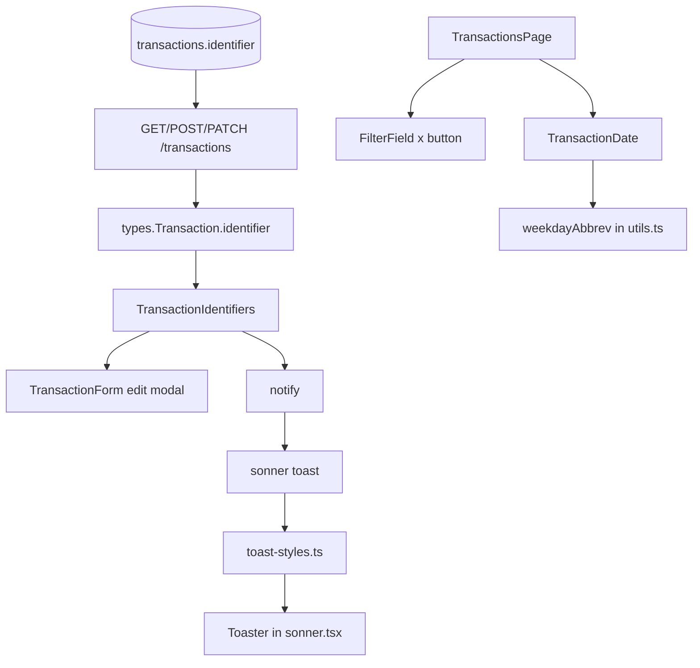

# Extrato: ajustes finos v2 Design

**Spec**: `.specs/features/transactions-ux-v2/spec.md`
**Status**: Approved

---

## Architecture Overview

Quatro mudanças independentes. Na API, `identifier` entra na leitura de `Transaction` e fica fora dos corpos de escrita. No `web/`, o modal de edição ganha um bloco de identificadores com botão de copiar, o `Toaster` ganha cores por tipo, os filtros do extrato ganham um "x" por filtro e as datas ganham o dia da semana. Todo componente novo é um arquivo pequeno, e `TransactionsPage.tsx` (717 linhas) só passa a usá-los.

Decisões de `STATE.md` aplicadas: AD-001 (apps independentes; os tipos do `web/` acompanham o `openapi.json` e o mock espelha a API), AD-002 (RLS pela transação por requisição; `identifier` herda a policy da tabela) e AD-005 (o dia da semana segue a data local que o extrato já mostra). Nenhuma decisão ativa é substituída.

Lições confirmadas aplicadas: L-006 (400 para falha de esquema e 422 para regra de domínio; aqui `identifier` não gera erro porque é ignorado), L-013 (falha de ação conferida em português: a cópia que falha mostra o texto do toast) e L-027 (testes jsdom leves: relógio só com `Date` falso, fuso por `process.env.TZ`, sem espera fixa, sem helper lento de data; cada teste novo bem abaixo de 5 s mesmo sob carga).



---

## Code Reuse Analysis

### Existing Components to Leverage

| Component | Location | How to Use |
| --------- | -------- | ---------- |
| `selectColumns`, `toTransaction`, `TransactionSchema` | `api/src/modules/transactions/schema.ts` | Ganham `identifier` (coluna, linha, mapeamento e esquema de resposta) |
| `CreateBody`, `UpdateBody` | `api/src/modules/transactions/routes.ts` | Não mudam: propriedades fora do esquema já são ignoradas (como `description` no PATCH) |
| Testes de `description` | `api/test/transactions.int.test.ts` (bloco `transaction description`) | Modelo do bloco `transaction identifier`: `create`, `call`, `getAdminSql` |
| `swagger.int.test.ts` | `api/test/` | Já falha se `api/openapi.json` está desatualizado |
| `notifySuccess`, `notifyError` | `web/src/lib/notify.ts` | O botão de copiar e o toast de info usam o helper; ganha `notifyInfo` |
| `Toaster` | `web/src/components/ui/sonner.tsx` | Passa a ler as classes de `toast-styles.ts` |
| Tema | `web/src/styles.css` (`:root` e `.dark`, OKLCH) e `tailwindcss/theme.css` | Fonte dos valores do teste de contraste |
| `formatDateLocal` | `web/src/lib/format.ts` | Fonte da data exibida; o dia da semana usa o mesmo fuso (`new Date(iso)` local) |
| `TransactionForm` | `web/src/features/transactions/TransactionForm.tsx` | Renderiza o bloco de identificadores na edição |
| `Filter`, `changeFilter`, `changeDate`, `clearQuick` | `web/src/features/transactions/TransactionsPage.tsx` | Os tratadores existentes viram o `onClear` de cada filtro |
| Mock de transações | `web/src/lib/api/mock/transactions.ts` | `identifier` na semente, no `hydrate` e no PATCH |
| Padrão de testes | `extratoFilters.test.tsx`, `extratoDescription*.test.tsx`, `apiSpy.tsx`, `datePicker.ts` | `renderWithQuery`, `responses` para itens fixos, `vi.mock("sonner")` para toasts |

### Integration Points

| System | Integration Method |
| ------ | ------------------ |
| `GET/POST/PATCH /transactions` | Resposta `Transaction` ganha `identifier`; os corpos de entrada não mudam |
| `api/openapi.json` | Regenerado por `pnpm -C api openapi:export` |
| Import | Já grava `identifier`; nenhuma mudança, a API só passa a expô-lo |
| Navegador | `navigator.clipboard.writeText` (só em contexto seguro) |

---

## Components

### API: `identifier` somente leitura

- **Purpose**: Expor a coluna existente sem aceitá-la para escrita.
- **Location**: `api/src/modules/transactions/schema.ts` (esquema, linha, `selectColumns`, `toTransaction`); `api/openapi.json`
- **Interfaces**:
  - `TransactionSchema` ganha `identifier: nullableString` com `description` "External identifier set by the import; read-only"; `TransactionRow.identifier: string | null`; `selectColumns` inclui `t.identifier`; `toTransaction` mapeia.
  - `CreateBody` e `UpdateBody` não mudam; `validPatch` e o `insert` do POST não leem `identifier`.
- **Dependencies**: nenhuma nova.
- **Reuses**: o mesmo caminho de leitura da `description`.

### `Transaction` do web e mock

- **Purpose**: Tipar e simular `identifier` como a API.
- **Location**: `web/src/lib/api/types.ts`, `web/src/lib/api/mock/transactions.ts`
- **Interfaces**: `Transaction.identifier: string | null` (somente leitura; fora de `TransactionInput` e de `TransactionUpdate`); semente com `identifier` em parte das linhas; `hydrate` grava `null`; o PATCH descarta `identifier` do corpo, como já faz com `description`.
- **Dependencies**: nenhuma.
- **Reuses**: a descarte de `description` no PATCH do mock.

### `TransactionIdentifiers`

- **Purpose**: Bloco somente leitura com "ID" e "Identificador externo" e botões de copiar.
- **Location**: `web/src/features/transactions/TransactionIdentifiers.tsx`
- **Interfaces**:
  - `TransactionIdentifiers({ id, identifier }: { id: string; identifier: string | null })` renderiza `<dl aria-label="Identificadores da transação">` com duas linhas `dt`/`dd`.
  - Helper interno `copyText(text, successMessage)`: `await navigator.clipboard.writeText(text)` seguido de `notifySuccess(successMessage)`; qualquer falha (inclusive `navigator.clipboard` indefinido) vai para `notifyError(reason)`.
  - Botões `Button variant="ghost" size="icon"` com `aria-label` "Copiar ID" e "Copiar identificador externo"; sem identificador, o `dd` mostra "—" e não há botão.
- **Dependencies**: `Button`, `notify`, ícone `Copy` do `lucide-react`.
- **Reuses**: `notify`.
- **Montagem**: `TransactionForm` renderiza o bloco entre o `DialogHeader` e o `form` só quando `transaction` existe.

### Estilo dos toasts

- **Purpose**: Cor por tipo, calculável e testável.
- **Location**: `web/src/components/ui/toast-styles.ts` (classes), `web/src/components/ui/sonner.tsx` (consome), `web/src/lib/notify.ts` (`notifyInfo`)
- **Interfaces**:
  - `toastClassNames: { toast, success, error, info, default, warning, loading, description, actionButton, cancelButton }`. A chave `toast` leva só layout (`group-[.toaster]:shadow-lg` e `border`); as cores ficam nas chaves por tipo, para não haver duas classes de cor da mesma propriedade no mesmo elemento. `success` e `error` levam par claro e `dark:` (`group-[.toaster]:bg-emerald-50 group-[.toaster]:text-emerald-900 group-[.toaster]:border-emerald-300 dark:group-[.toaster]:bg-emerald-950 ...`); `info`, `default`, `warning` e `loading` compartilham a constante neutra (`bg-background text-foreground border-border`). `description` usa `text-current` para herdar o texto do tipo.
  - `notifyInfo(message: string): void` - `toast.info(message)`.
- **Dependencies**: `sonner` 2.0.x, Tailwind 4 (variante `dark` do projeto).
- **Reuses**: o prefixo `group-[.toaster]:` do wrapper atual.
- **Teste de contraste**: `web/src/test/colorContrast.ts` (helper) converte OKLCH para sRGB e calcula a razão WCAG; `web/src/components/ui/toast-styles.test.ts` lê `tailwindcss/theme.css` e `web/src/styles.css`, resolve cada classe de fundo e de texto de `toastClassNames` e afirma razão ≥ 4,5 e matiz por tipo.

### `FilterField`

- **Purpose**: Rótulo de filtro com o "x" opcional.
- **Location**: `web/src/features/transactions/FilterField.tsx`
- **Interfaces**:
  - `FilterField({ label, id, onClear?, clearLabel?, children })`: `Label htmlFor={id}` e, quando `onClear` existe, um `Button variant="ghost" size="icon"` pequeno com ícone `X` e `aria-label` `Limpar filtro ${clearLabel ?? label}`.
  - `ClearButton({ label, onClick })` exportado para o "x" interno da busca.
- **Dependencies**: `Label`, `Button`, ícone `X`.
- **Reuses**: o `Filter` atual da página, que ele substitui.

### Extrato: "x" por filtro

- **Purpose**: Ligar cada filtro ativo ao seu tratador.
- **Location**: `web/src/features/transactions/TransactionsPage.tsx`
- **Interfaces**:
  - Tipo, Conta, Categoria e Neutra: `onClear={filters.<chave> !== undefined ? () => changeFilter("<chave>", undefined) : undefined}` (`changeFilter` já volta à página 1 e preserva `sort`/`order`).
  - De e Até: `onClear` só quando há valor e `!quickActive`, chamando `changeDate(chave, "")`.
  - Mês rápido: `FilterField label="Mês" clearLabel="Mês rápido"` com `onClear={clearQuick}` só quando `quickActive`.
  - Busca: `ClearButton` dentro do campo (`absolute right-2`), visível quando `search !== ""`, que faz `setSearch("")` e remove `q` do estado na hora com `page: 1` (o efeito de debounce depois não encontra mudança).
- **Dependencies**: `FilterField`.
- **Reuses**: `changeFilter`, `changeDate`, `clearQuick`, `applyDateFilter`.

### Dia da semana

- **Purpose**: Abreviação do dia da semana da data local, e a célula que a mostra.
- **Location**: `web/src/features/transactions/utils.ts` (`weekdayAbbrev`), `web/src/features/transactions/TransactionDate.tsx`
- **Interfaces**:
  - `weekdayAbbrev(iso: string): string`: `const date = new Date(iso)`; inválido devolve `""`; senão `["Dom", "Seg", "Ter", "Qua", "Qui", "Sex", "Sáb"][date.getDay()]`. Mesmo fuso de `formatDateLocal` (o local do navegador). Nunca usa `new Date("YYYY-MM-DD")`.
  - `TransactionDate({ occurredAt }: { occurredAt: string })`: `<div>` com a data de `formatDateLocal` e, quando o texto não é vazio, `<div data-testid="transaction-weekday" className="text-xs text-muted-foreground">`.
- **Dependencies**: `formatDateLocal`.
- **Reuses**: `formatDateLocal`.
- **Montagem**: a célula da data da tabela usa `TransactionDate`; no cartão móvel, o parágrafo da data vira `flex items-start gap-1.5` com `TransactionDate`, o "·" e `TransactionAccount`.

---

## Data Models

Sem migration. Tipos e esquema:

```typescript
// api: TransactionSchema ganha
identifier: Type.Union([Type.String(), Type.Null()], {
  description: 'External identifier set by the import (e.g. the bank transaction id); read-only',
}),

// web
export type Transaction = { /* ... */ identifier: string | null };
// TransactionInput e TransactionUpdate NÃO ganham `identifier`.
```

**Relationships**: `identifier` é a coluna `transactions.identifier text` (nula para lançamentos manuais), com índice parcial por `(account_id, identifier)` usado pelo import.

---

## Error Handling Strategy

| Error Scenario | Handling | User Impact |
| -------------- | -------- | ----------- |
| `identifier` enviado no POST ou no PATCH | Ignorado; 201 com `identifier: null` ou 200 com o valor guardado | Nenhum efeito |
| `navigator.clipboard` indefinido ou escrita rejeitada | `notifyError(reason)` | Toast "Não foi possível concluir a operação. Tente novamente."; modal aberto |
| `identifier` nulo | `dd` mostra "—" e não renderiza o botão | Sem botão para copiar |
| `occurredAt` inválido | `weekdayAbbrev` devolve `""` e `TransactionDate` não renderiza a linha | Só a data (vazia, como hoje) |
| Período invertido e "x" de De ou Até | O alerta existente depende de `from > to` e some com a remoção | Alerta some |

---

## Risks & Concerns

| Concern | Location (file:line) | Impact | Mitigation |
| ------- | -------------------- | ------ | ---------- |
| `TransactionsPage.tsx` já tem 717 linhas e três responsabilidades | `web/src/features/transactions/TransactionsPage.tsx:1` | Os dois ajustes na página engordam o arquivo e dificultam o teste | Componentes novos em arquivos próprios (`FilterField`, `TransactionDate`, `TransactionIdentifiers`); a página só os usa. Dívida de dividir a página fica registrada, fora desta feature |
| Duas classes de cor da mesma propriedade no mesmo toast dependem da ordem do CSS gerado | `web/src/components/ui/sonner.tsx:14` | Cor do tipo poderia perder para `bg-background` e o toast ficaria neutro | Cores só nas chaves por tipo, nenhuma cor na chave `toast`; o teste renderiza um toast real e confere que a chave de cor é a do tipo; a compilação do Tailwind com as classes é conferida na task |
| Variante `dark:` composta com `group-[.toaster]:` sem conferência no navegador | `web/src/components/ui/sonner.tsx:14` | Toast escuro poderia manter as cores claras | Compilar as classes com o `@tailwindcss/node` e conferir a regra `:is(.dark *)` no CSS gerado; conferência final no navegador listada para o dono |
| O `Toaster` usa o tema `light` padrão do `sonner` | `web/src/components/ui/sonner.tsx` | Ícone e botão de fechar do `sonner` seguem o tema `light` mesmo no escuro | Fora do pedido (cores por tipo); as cores de texto e fundo vêm das classes e o ícone herda `currentColor` |
| `navigator.clipboard` só existe em HTTPS ou localhost | `web/src/features/transactions/TransactionIdentifiers.tsx` | Em HTTP o botão falharia em silêncio | `copyText` trata o `undefined` e emite o toast de erro; teste cobre |
| `getByLabelText` com texto parcial nos testes existentes pode casar com o novo `aria-label` "Limpar filtro ..." | `web/src/features/transactions/extratoFilters.test.tsx` | Teste existente poderia achar dois elementos | Os testes usam rótulos exatos; a task roda a suíte inteira e ajusta só o que o novo botão quebrar, sem enfraquecer asserções |
| O cartão móvel junta data, "·" e conta numa linha de texto | `web/src/features/transactions/TransactionsPage.tsx:610` | Testes que leem o texto do cartão podem quebrar | A task confere os testes de conta e de descrição e atualiza só a estrutura, mantendo as asserções |
| `new Date(iso).getDay()` depende de `TZ` do processo nos testes | `web/src/features/transactions/utils.test.ts` | Teste instável se o fuso vazar entre testes | Cada teste fixa e restaura `process.env.TZ` (padrão do `utils.test.ts` atual); só `Date` é falso |

---

## Tech Decisions (only non-obvious ones)

| Decision | Choice | Rationale |
| -------- | ------ | --------- |
| `identifier` ignorado em vez de 422 | Ignorar no POST e no PATCH | Mesmo critério da `description` no PATCH: propriedades fora do esquema já são ignoradas e clientes que reenviam o objeto lido não quebram |
| Cores por `classNames` e não `richColors` | Classes por tipo em `toast-styles.ts` | As cores do `richColors` são fixas no CSS do `sonner`; com as classes o contraste vem dos valores do tema, como pedido |
| Cor só nas chaves por tipo | `toast` sem classe de cor | Evita conflito de ordem entre duas classes de `background` |
| Contraste calculado em teste | Ler `theme.css` do Tailwind e `styles.css`, OKLCH para sRGB, razão WCAG | Verificação objetiva sem navegador, e não afirma nomes de classe |
| `notifyInfo` sem uso nos fluxos | Helper existe e é testado | Mantém o canal único e deixa o tipo neutro alcançável |
| Dia da semana por `getDay()` local | Reusa o mesmo fuso de `formatDateLocal` | Data e dia da semana não divergem; evita o erro de `new Date("YYYY-MM-DD")` |
| "x" da busca dentro do campo | `ClearButton` à direita do input | A busca não tem rótulo visível para ancorar o botão |
