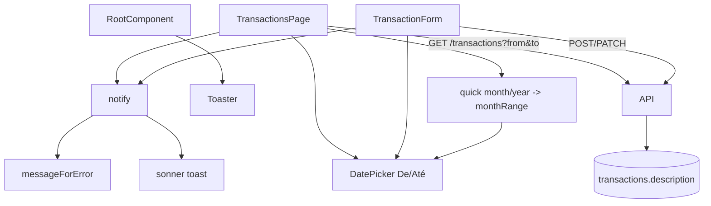

# Extrato: UX e descrição Design

**Spec**: `.specs/features/transactions-ux/spec.md`
**Status**: Draft

---

## Architecture Overview

Dois blocos independentes. No `web/`, dois componentes compartilhados novos (`notify` e `DatePicker`) alimentam o extrato e o formulário, e a página do extrato ganha o filtro rápido (um estado próprio, `quick`, ao lado de `filters`). No `api/` e no banco, a coluna `description` entra na leitura e na criação e fica fora do PATCH. A migration `0007` leva também o `Other` no check de `payment_method`, mas só a migration é desta feature.

Decisões de `STATE.md` aplicadas: AD-001 (apps independentes; os tipos do `web/` acompanham o OpenAPI), AD-002 (RLS pela transação por requisição; `description` herda a policy da tabela) e AD-005 (as datas do filtro são dia local `YYYY-MM-DD`, o fuso vai no cabeçalho `X-Timezone`). Nenhuma decisão ativa é substituída.

Lições confirmadas aplicadas: L-006 (400 para falha de esquema, 422 para regra de domínio, também em `description`) e L-013 (todo teste de falha de ação destrutiva e de lista condicional confere o texto em português e as opções visíveis).



---

## Code Reuse Analysis

### Existing Components to Leverage

| Component | Location | How to Use |
| --------- | -------- | ---------- |
| `Toaster` (shadcn) | `web/src/components/ui/sonner.tsx` | Já existe; só é montado uma vez no `RootComponent` |
| `sonner` (`toast`) | dependência `sonner@^2.0.7` | O helper `notify` é o único chamador de `toast` |
| `messageForError` | `web/src/lib/api/errorMessages.ts` | Fonte única do texto de erro; contexto `"transaction"` |
| `Calendar`, `Popover`, `Button` | `web/src/components/ui/{calendar,popover,button}.tsx` | Base do `DatePicker` (react-day-picker 9 + date-fns 4, locale `ptBR` de `date-fns/locale`) |
| `Select` | `web/src/components/ui/select.tsx` | Seletores de mês e ano do filtro rápido, como o `SimpleSelect` da página |
| `TransactionsPage`, `TransactionForm` | `web/src/features/transactions/` | Recebem os componentes novos |
| `utils.ts` | `web/src/features/transactions/utils.ts` | Ganha `monthRange` e `todayLocal` |
| Padrão de testes | `extratoFilters.test.tsx`, `extratoCrud.test.tsx`, `extratoInline.test.tsx`, `src/test/apiSpy.tsx` | `renderWithQuery` e `spiedApiRequest`; `vi.mock("sonner")` para capturar o toast |
| `optionalText` | `api/src/modules/transactions/routes.ts` | Mesmo aparo/vazio-vira-`null` de `notes` na `description` |
| `swagger.int.test.ts` | `api/test/` | Já falha se `api/openapi.json` está desatualizado |
| `transactions-schema.int.test.ts` | `api/test/` | Estende o teste de constraints com `Other` |
| Mock de transações | `web/src/lib/api/mock/transactions.ts` | `hydrate`, handlers POST e PATCH ganham `description` |

### Integration Points

| System | Integration Method |
| ------ | ------------------ |
| `GET /transactions` | O filtro rápido usa `from`/`to` existentes (dia local); sem mudança de contrato |
| `POST /transactions` | Novo campo opcional `description`; resposta 201 passa a incluir `description` |
| `PATCH /transactions/:id` | Sem campo novo no esquema; `description` no corpo é ignorada pelo `validPatch` |
| `supabase/migrations/0007_transactions_description.sql` | Dois `alter table` independentes; a feature import-fixes compartilha o arquivo e o `Other` |
| `api/openapi.json` | Regenerado por `pnpm -C api openapi:export` |

---

## Components

### `notify` (helper de toast)

- **Purpose**: Único ponto de emissão de toasts, com texto de erro vindo do mapa de mensagens.
- **Location**: `web/src/lib/notify.ts` (e `web/src/lib/notify.test.ts`)
- **Interfaces**:
  - `notifySuccess(message: string): void` - `toast.success(message)`
  - `notifyError(error: unknown, context?: ErrorContext): void` - `toast.error(messageForError(error, context))`
- **Dependencies**: `sonner`, `messageForError`.
- **Reuses**: `ErrorContext` e `GENERIC_ERROR` de `errorMessages.ts`.
- **Montagem**: `RootComponent` em `web/src/routes/__root.tsx` renderiza `<Toaster />` (de `@/components/ui/sonner`) uma vez, dentro de `QueryClientProvider`, depois do `Outlet`. Nenhuma outra rota monta outro `Toaster`.

### `DatePicker`

- **Purpose**: Seletor de data com calendário em pt-BR que entrega `YYYY-MM-DD`.
- **Location**: `web/src/components/ui/date-picker.tsx` (e `date-picker.test.tsx`)
- **Interfaces**:
  - `DatePicker(props: { id?: string; value: string; onChange: (value: string) => void; disabled?: boolean; clearable?: boolean; placeholder?: string; "aria-label"?: string })`
  - Helpers internos puros e exportados para teste: `parseLocalDate(value: string): Date | undefined` (valida `^\d{4}-\d{2}-\d{2}$`, monta `new Date(y, m - 1, d)` e confere que os getters devolvem o mesmo dia) e `formatLocalDate(date: Date): string` (getters locais, `padStart`).
- **Comportamento**: gatilho `Button` (`variant="outline"`) com `id`, mostra `format(date, "dd/MM/yyyy", { locale: ptBR })` ou "Selecione a data"; `PopoverContent` com `Calendar mode="single" locale={ptBR} captionLayout="dropdown"` (faixa do ano 2000 até o ano atual mais 5), `selected` = data local, `onSelect` chama `onChange(formatLocalDate(date))` e fecha o popover; botão "Limpar" aparece quando há valor e `clearable` (padrão `true`) e chama `onChange("")`; `disabled` desabilita o gatilho. Nunca usa `toISOString`, `Date.parse` nem `new Date("YYYY-MM-DD")`.
- **Dependencies**: `Calendar`, `Popover`, `Button`, `date-fns`.
- **Reuses**: componentes shadcn já no projeto.

### `monthRange` e `todayLocal`

- **Purpose**: Regras puras de data do extrato e do formulário.
- **Location**: `web/src/features/transactions/utils.ts` (testes em `utils.test.ts` ou no arquivo de filtros)
- **Interfaces**:
  - `monthRange(year: number, month: number): { from: string; to: string }` - `month` de 1 a 12; `to` = `new Date(Date.UTC(year, month, 0)).getUTCDate()` (dias do mês por aritmética de calendário, sem fuso); retorna `YYYY-MM-DD` com `padStart`.
  - `todayLocal(now?: Date): string` - `YYYY-MM-DD` com os getters locais; `now` injetável para teste.
  - `applyDateFilter(state: { filters: TransactionFilters; quick: QuickMonth | undefined }, key: "from" | "to", value: string)` - pura: define a data e zera `quick` (invariante da regra "escolher data desativa o rápido").
- **Dependencies**: nenhuma.

### Extrato: filtros, coluna Tipo, toasts e `description`

- **Purpose**: Aplicar os componentes novos e as correções na página.
- **Location**: `web/src/features/transactions/TransactionsPage.tsx`
- **Interfaces**:
  - Estado novo `quick: { year?: number; month?: number }`; o filtro só está ativo quando `year` e `month` existem (`quickActive`). `setQuick` com os dois valores faz `setFilters({ ...current, from, to, page: 1 })` com `monthRange`.
  - `De`/`Até`: `DatePicker` com `id="filter-from"`/`"filter-to"`, `value={filters.from ?? ""}`, `disabled={quickActive}`, `onChange` via `applyDateFilter`.
  - Seletores "Mês" (`filter-quick-month`, Janeiro a Dezembro) e "Ano" (`filter-quick-year`, do ano atual menos 5 até o ano atual mais 1) e botão "Limpar mês" (`quick` vazio e remove `from`/`to`).
  - "Limpar filtros": `setFilters(baseFilters)`, `setSearch("")`, `setQuick({})`.
  - Remove `<TableHead>Tipo</TableHead>`, a célula `transactionTypeLabels[item.type]` e o `div` "Tipo" do cartão; o filtro Tipo fica.
  - `saveInline` e `applyBulk`: `notifySuccess`/`notifyError(reason, "transaction")` e remoção de `actionError` e do `<p role="alert">`; a exclusão chama `notifySuccess("Transação excluída")` ou `notifyError`.
  - Célula do nome: `<div>{name}</div>` e, quando `item.description`, `<div className="max-w-xs truncate text-xs text-muted-foreground" title={item.description}>`; o cartão móvel tem a mesma linha.
- **Dependencies**: `DatePicker`, `notify`, `utils`.
- **Reuses**: `Filter`, `SimpleSelect`, `changeFilter`.

### `TransactionForm`

- **Purpose**: Data com `DatePicker`, data de hoje correta, toasts e subtítulo da `description`.
- **Location**: `web/src/features/transactions/TransactionForm.tsx`
- **Interfaces**: `initial.date` passa a ser `todayLocal()` calculado na abertura (não em carga de módulo); campo Data usa `DatePicker id="transaction-date"`; sucesso chama `notifySuccess(transaction ? "Transação atualizada" : "Transação criada")` depois de `onOpenChange(false)`; falha chama `notifyError(reason, "transaction")` além do erro inline; `DialogDescription` mostra a `description` somente leitura em edição quando existe (`<p data-testid="transaction-description">`), senão mantém "Preencha os dados do lançamento.".
- **Dependencies**: `DatePicker`, `notify`, `todayLocal`.
- **Reuses**: `Field`, `fieldForError`, `toLocalDateInput`.

### API: `description`

- **Purpose**: Coluna e campo de leitura e criação; PATCH fora.
- **Location**: `supabase/migrations/0007_transactions_description.sql`, `api/src/modules/transactions/schema.ts`, `api/src/modules/transactions/routes.ts`
- **Interfaces**:
  - `TransactionSchema` ganha `description: nullableString`; `TransactionRow.description`; `selectColumns` inclui `t.description`; `toTransaction` mapeia.
  - `CreateBody` ganha `description: Type.Optional(nullableString)` (falha de tipo vira 400 pelo esquema); `UpdateBody` não muda.
  - `MAX_DESCRIPTION = 500`; `validDescription(value): string | null` aplica `optionalText` e lança `invalid("description must have at most 500 characters", "description")` (422) quando excede; o `insert` do POST grava a coluna.
  - `validPatch` não lê `description`.
- **Dependencies**: `optionalText`, `invalid`.
- **Reuses**: o padrão de `notes`.

---

## Data Models

### Migration `0007_transactions_description.sql`

```sql
-- Part 1 (transactions-ux): original title of the transaction, read-only after creation.
alter table public.transactions add column description text;

-- Part 2 (import-fixes): accept the 'Other' payment method. The constraint name is the one
-- Postgres generated for the inline check in 0003.
alter table public.transactions drop constraint transactions_payment_method_check;
alter table public.transactions add constraint transactions_payment_method_check
  check (payment_method in
    ('BankTransfer', 'Boleto', 'Cash', 'CreditCard', 'DebitCard', 'NuPay', 'PIX', 'Other'));
```

A parte 1 é aditiva e sem `check`. O teste de migration cobre as duas partes (coluna nula por padrão, `Other` aceito, valor inválido ainda rejeitado com `transactions_payment_method_check`).

### Tipos do web

```typescript
export type Transaction = { /* ... */ description: string | null };
// TransactionInput e TransactionUpdate NÃO ganham `description`.
export type QuickMonth = { year?: number; month?: number }; // só no estado da página
```

**Relationships**: `description` pertence à própria linha de `transactions`; sem relação nova.

---

## Error Handling Strategy

| Error Scenario | Handling | User Impact |
| -------------- | -------- | ----------- |
| Categoria (massa ou linha) falha | `notifyError(reason, "transaction")`; rollback do `useUpdateTransaction`; seleção mantida no lote | Toast com a mensagem do mapa; categoria anterior volta |
| Neutra falha | Rollback otimista e `notifyError` | Toast; switch volta |
| Exclusão falha | `notifyError`; linha permanece | Toast |
| Criação ou edição falha | Erro de campo inline quando há `field`, mais `notifyError`; diálogo aberto | Mensagem no campo e toast |
| Erro de rede ou código desconhecido | `messageForError` devolve `GENERIC_ERROR` | "Não foi possível concluir a operação. Tente novamente." |
| `description` > 500 depois de aparada (POST) | 422 `validation_error`, `field: "description"` | Fora da UI (o formulário não envia `description`); coberto na API |
| `description` com tipo errado (POST) | 400 `validation_error` pelo esquema | Idem |
| `description` no PATCH | Ignorada, 200 | Nenhum efeito |
| String de data inválida no `DatePicker` | `parseLocalDate` devolve `undefined`; mostra o placeholder | Campo parece vazio |

---

## Risks & Concerns

| Concern | Location (file:line) | Impact | Mitigation |
| ------- | -------------------- | ------ | ---------- |
| Bug "De/Até preenchidos" não se reproduz no estado: `baseFilters` já não tem `from`/`to` | `web/src/features/transactions/TransactionsPage.tsx:49` | Corrigir só o estado não resolve o que o usuário vê (placeholder `dd/mm/aaaa` do input nativo) | T3 reproduz no navegador primeiro; o `DatePicker` com placeholder "Selecione a data" e o teste de consulta sem `from`/`to` cobrem as duas hipóteses |
| `new Date().toISOString().slice(0, 10)` no carregamento do módulo: data em UTC e congelada na carga | `web/src/features/transactions/TransactionForm.tsx:47` | Depois das 21h em Brasília a data padrão é o dia seguinte; aba aberta por dias mantém a data antiga | `todayLocal()` calculado ao abrir o formulário (TUX-06) |
| Testes existentes usam `fireEvent.change` em `getByLabelText("De")` | `web/src/features/transactions/extratoFilters.test.tsx:86` | O `DatePicker` não é um `input`; os testes quebram | T3 reescreve a interação (abrir popover e escolher o dia) e mantém a asserção da consulta |
| Testes da front-fixes dependem do alerta `role="alert"` e do texto "Não foi possível salvar a categoria" | `web/src/features/transactions/extratoInline.test.tsx`, `transactions.test.tsx` | Quebram quando o alerta fixo sai | T5 atualiza para capturar `toast.error` (mock de `sonner`) com a mensagem do mapa |
| Dois `Toaster` ou nenhum | `web/src/routes/__root.tsx:123` | Toast duplicado ou invisível | T1 monta uma vez e testa a contagem de regiões "Notifications" |
| `description` > 500 no import (F2) violaria a regra da API se a coluna tivesse check, ou geraria linha maior que o limite | `supabase/migrations/0007_transactions_description.sql` | Import atômico poderia falhar | Coluna sem check; a F2 trunca em 500 e testa |
| PATCH ignora `description` silenciosamente | `api/src/modules/transactions/routes.ts:273` | Cliente que tente editar acha que salvou | Decisão registrada (ignorar, como os demais campos desconhecidos); teste e `openapi.json` sem o campo no PATCH |
| A 0007 é compartilhada com a import-fixes | `supabase/migrations/0007_transactions_description.sql` | Conflito de merge ou parte esquecida | Dois comandos separados e comentados; a T7 é a dona da migration inteira, e a F2 só consome |
| Popover do `DatePicker` dentro de `Dialog` do formulário | `web/src/features/transactions/TransactionForm.tsx` | Foco ou camada (z-index) do popover dentro do modal | Teste de interação no formulário; `PopoverContent` já renderiza em portal acima do dialog |

---

## Tech Decisions (only non-obvious ones)

| Decision | Choice | Rationale |
| -------- | ------ | --------- |
| Erros de ação em toast, sem alerta fixo | Remover `actionError` da página | Dois canais de erro confundem; o toast é o canal único |
| Estado do filtro rápido separado de `filters` | `quick` próprio; `from`/`to` continuam a fonte da consulta | A API não conhece o rápido; o estado só decide a desabilitação dos pickers |
| `description` ignorada no PATCH em vez de 422 | Ignorar | Propriedades desconhecidas já são ignoradas no módulo; evita quebrar clientes que reenviam o objeto lido |
| Sem `check` de tamanho no banco | Só a API valida 500 | O import (F2) controla o truncamento; o banco não é a camada de regra aqui |
| Teste de toast | `vi.mock("sonner")` e asserção do texto exato | Evita depender da animação do `sonner` no jsdom; o teste do `Toaster` cobre a montagem |
| `DatePicker` em `components/ui/` | `date-picker.tsx` | Mesmo lugar dos componentes shadcn; reutilizável por outras telas depois |
