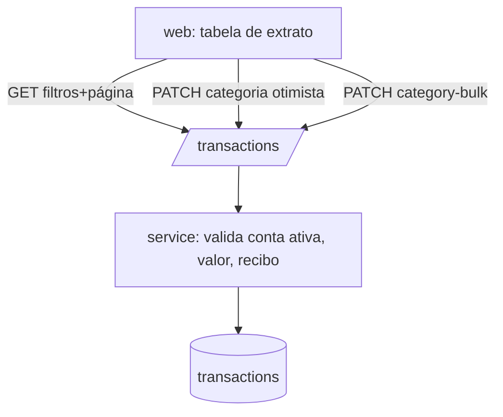

# Transações Design

**Spec**: `.specs/features/transactions/spec.md`
**Status**: Draft

---

## Architecture Overview

Módulo REST `transactions` com listagem filtrada e paginada no servidor, CRUD, edição de categoria individual e em lote, e alternância de neutra. No `web/` a tabela usa estado de consulta no servidor; a troca de categoria é otimista com rollback.



---

## Code Reuse Analysis

### Existing Components to Leverage

| Component | Location | How to Use |
| --------- | -------- | ---------- |
| `withUser`, `AppError`, `request.tz` | `api/src/plugins/*` | Acesso a dados, erros, fuso |
| `AccountSelect`, `CategorySelect` | `web/src/features/accounts`, `categories` | Formulário e filtros |
| Cliente `api` | `web/src/lib/api` | Chamadas tipadas |

### Integration Points

| System | Integration Method |
| ------ | ------------------ |
| `import` | Insere linhas na mesma tabela com `import_batch_id` |
| `dashboards` | Lê a tabela via fragmentos de `rules.ts` (AD-003) |

---

## Components

### `api/src/modules/transactions`

- **Purpose**: Persistir e consultar transações.
- **Interfaces**:
  - `GET /transactions?from&to&accountId&categoryId&type&neutral&q&sort&order&page` - `from/to` são datas locais (`YYYY-MM-DD`) convertidas para instantes com `request.tz`; `sort` ∈ `date|name|amount|category`; resposta `{ items, total, page, pageSize: 50 }`.
  - `POST /transactions` - cria; categoria padrão = `Uncategorized`; rejeita conta inativa ou de outro usuário.
  - `PATCH /transactions/:id` - altera campos editáveis; preserva os demais.
  - `DELETE /transactions/:id`.
  - `PATCH /transactions/category` - `{ ids[], categoryId }` em um único `UPDATE`; se algum id não for do usuário, 404 e nada é alterado.
- **Dependencies**: `withUser`; extensão `unaccent` para busca.
- **Reuses**: `AppError`.

### `api/src/modules/transactions/validation.ts`

- **Purpose**: Validações de entrada (AD-004).
- **Interfaces**: `parseAmount(s: string): string` (regex `^\d{1,12}(\.\d{1,2})?$`, > 0); `parseReceiptUrl(s)` (somente `http`/`https`).

### `web/src/features/transactions`

- **Purpose**: Tabela, filtros, busca, formulário, edição inline, seleção em lote.
- **Interfaces**:
  - `<TransactionsTable />` - colunas da spec, ordenação, paginação, estado vazio "Nenhuma transação encontrada".
  - `<TransactionForm />` - criação/edição; valida valor e URL no cliente.
  - `useUpdateCategory()` - mutação otimista com rollback e mensagem.
  - `useBulkCategory()` - aplica categoria às linhas selecionadas.
- **Reuses**: `formatBRL` e `formatDateLocal` em `web/src/lib/format`.

---

## Data Models

```sql
-- supabase/migrations/0003_transactions.sql
create extension if not exists unaccent;

create table public.transactions (
  id uuid primary key default gen_random_uuid(),
  user_id uuid not null default auth.uid() references auth.users(id) on delete cascade,
  account_id uuid not null,
  category_id uuid not null,
  name text not null check (length(btrim(name)) > 0),
  type text not null check (type in ('Income','Expense')),
  occurred_at timestamptz not null,
  amount numeric(14,2) not null check (amount > 0),
  payment_method text not null check (payment_method in
    ('BankTransfer','Boleto','Cash','CreditCard','DebitCard','NuPay','PIX')),
  notes text,
  receipt text,
  identifier text,
  counterparty_document text,
  counterparty_bank text,
  neutral boolean not null default false,
  import_batch_id uuid,              -- fk adicionada na migration de importação
  created_at timestamptz not null default now(),
  foreign key (account_id, user_id) references public.accounts(id, user_id) on delete restrict,
  foreign key (category_id, user_id) references public.categories(id, user_id) on delete restrict
);
create index transactions_user_date_idx on public.transactions (user_id, occurred_at desc);
create index transactions_account_identifier_idx on public.transactions (account_id, identifier)
  where identifier is not null;
create index transactions_user_category_idx on public.transactions (user_id, category_id);

alter table public.transactions enable row level security;
create policy transactions_all on public.transactions for all
  using (user_id = auth.uid()) with check (user_id = auth.uid());
```

**Relationships**: `account_id` e `category_id` com FK composta com `user_id` (impede referenciar dado de outro usuário). Contrato de API: `amount` como string decimal, `occurredAt` ISO-8601 UTC.

---

## Error Handling Strategy

| Error Scenario | Handling | User Impact |
| -------------- | -------- | ----------- |
| Valor ≤ 0 ou > 2 casas | 422 `invalid_amount` | Mensagem no campo valor |
| Campo obrigatório vazio | 422 com `field` | Mensagem no campo |
| Conta inativa/estranha na criação | 422 `invalid_account` | "Selecione uma conta ativa" |
| Recibo não é URL http(s) | 422 `invalid_receipt_url` | "URL inválida" |
| Falha ao salvar categoria inline | Rollback otimista | Categoria anterior + mensagem de erro |
| Lote com id desconhecido | 404, transação revertida | Nada muda; mensagem de erro |

---

## Risks & Concerns

| Concern | Location (file:line) | Impact | Mitigation |
| ------- | -------------------- | ------ | ---------- |
| Busca `unaccent` + `ILIKE '%q%'` não usa índice | `transactions/service.ts` (a criar) | Lentidão com muitos milhares de linhas | Aceitável no MVP pessoal; `pg_trgm` + índice GIN como evolução |
| Ordenação por coluna de outra tabela (categoria) com paginação | `transactions/service.ts` | Ordem instável entre páginas | Desempate por `id` em toda ordenação |
| FK de `category_id`/`account_id` com `on delete restrict` e exclusão de usuário em cascata: o resultado depende da ordem de criação das constraints (verificado na validação de accounts-categories) | `0003_transactions.sql` | Exclusão de usuário pode falhar | Usar `on delete no action` nas FKs compostas para `categories`/`accounts` e testar a exclusão de um usuário que tenha transações |
| Fuso nos filtros de data | `transactions/service.ts` | Dia incorreto nas bordas | Converter `from/to` para instantes locais com Luxon e testar bordas de meia-noite |

---

## Tech Decisions (only non-obvious ones)

| Decision | Choice | Rationale |
| -------- | ------ | --------- |
| Paginação | Offset + `total` | Volume pessoal pequeno; simples |
| Edição de categoria | Endpoint dedicado de lote reutilizado para 1 linha | Um caminho de código para individual e lote |
| Listagem | Servidor filtra, ordena e pagina | Spec exige ordenar a lista inteira (TXN-01.5) |
| UI | Tailwind + shadcn/ui, TanStack Query/Table, React Hook Form + Zod | Padrão de mercado para React + Vite; sem preferência do usuário (revisável) |
